# Computational Engineering: A Comprehensive Framework

**Zooming in on the engineering problem genres...**

## 1. What Is Computational Engineering?

### 1.1 The Core Loop

Computational engineering (CompEng) is the discipline of using mathematical models, numerical simulation, and algorithmic search to design, analyze, and understand engineered systems — replacing or augmenting physical prototyping with virtual experimentation.

At its heart, most CompEng workflows follow a universal loop:

1. **Parameterize** the design. Represent the system as a set of numerical parameters under a common data structure — geometric coordinates of key points, material properties, operating conditions, or any other design variables.
2. **Simulate** the system. Feed those parameters into a physics-based solver (finite element analysis, computational fluid dynamics, molecular dynamics, etc.) to compute performance metrics — stress, drag, binding affinity, power output, or whatever the relevant indicators are.
3. **Search or analyze** the parameter space. Use optimization algorithms, uncertainty quantification, inverse methods, or other computational strategies to explore the space of possible designs and converge on the best, most robust, or most informative ones.

This loop applies identically whether the system is a bicycle frame, an aircraft wing, a drug molecule, a tokamak plasma, or a semiconductor chip. The fields differ in what physics they simulate and what they optimize for, but the computational engineering framework is the same.

### 1.2 Parametric Search vs. Generative Search

The core loop as stated in §1.1 implicitly assumes the parameter space is predefined — the engineer decides in advance which variables to explore and their ranges, and the optimizer navigates within that representation. This is **parametric search**: explore within a fixed design encoding. A bicycle frame parameterized by 12 tube dimensions, a wing defined by 30 control points, a chemical reactor defined by temperature, pressure, and flow rate — all are parametric.

But a distinct and increasingly important mode is **generative search**, where the computational system proposes candidates that were never representable in any fixed parameterization. A generative chemistry model that invents a novel molecular scaffold, a topology optimizer that discovers an entirely new structural form, or a generative adversarial network that proposes a geometry no engineer parameterized — all are expanding the design space itself, not just searching within it.

The distinction matters structurally. In parametric search, the dimensionality and topology of the search space are fixed — the optimizer's job is navigation. In generative search, the representation is open-ended — the system must simultaneously decide *what space to search in* and *where in that space to look*. Generative search is harder to validate (the generated candidate may lie outside any validated simulation envelope), harder to constrain (how do you enforce manufacturing limits on a design that wasn't parameterized with manufacturing in mind?), and harder to interpret (a generated design may have no obvious mapping back to engineering intuition). But its ceiling is higher: it can find designs that parametric search is structurally blind to.

In practice, most mature CompEng pipelines interleave both modes: generative methods propose candidates, which are then re-parameterized and refined via classical optimization. The interface between the two — translating a generative proposal into a form amenable to physics-based simulation and constrained optimization — is itself a nontrivial computational problem.

### 1.3 Optimization as an Inverse Problem

A large class of CompEng problems can be framed as inverse problems. The forward problem is deterministic: given specific inputs (geometry, material, boundary conditions), compute the outputs (stress, flow, performance). The inverse problem reverses this: given a desired outcome — or at least a vague idea of what the best outcome should be — find the inputs that produce it. Optimization algorithms bridge this gap, systematically exploring the parameter space to find local or global optima as efficiently as possible.

### 1.4 Beyond Optimization

However, optimization is only one of several equally fundamental problem genres in engineering. Forward prediction, inverse problems, uncertainty quantification, control, multiscale bridging, stability analysis, verification and validation, fault diagnosis, and data assimilation each represent distinct intellectual challenges with their own methodologies. These are covered in detail in Section 4.

### 1.5 The Modeling and Numerical Methods Layer

Getting the simulation kernel right is often the harder, more nuanced part of computational engineering: choosing the correct physics, discretization scheme, boundary conditions, and validating that the simulation actually predicts reality. The field encompasses the development and refinement of these numerical methods themselves — finite element methods, spectral methods, boundary element methods, meshless methods, particle-based methods, and lattice Boltzmann methods, among others.

### 1.6 The Computational Efficiency Layer

Making the simulation kernel fast enough for practical use is its own subfield. Techniques include surrogate modeling (training a cheap approximation of an expensive simulation), model order reduction, adaptive mesh refinement, parallel and GPU-accelerated computing, domain decomposition, and multi-fidelity methods that combine cheap low-resolution models with expensive high-fidelity ones.

### 1.7 The Realizability Layer

Between the optimizer proposing a design and that design existing in the physical world sits a computational problem the framework must account for: **can this design actually be built?**

Realizability prediction is itself a hard computational problem, distinct from both forward simulation (which assumes the design exists) and optimization (which searches for the best design). In drug discovery, retrosynthetic analysis asks: given a target molecule, does a viable synthetic route exist, and at what cost? In additive manufacturing, build simulation predicts whether a geometry will print successfully or suffer warping, delamination, or support failure. In semiconductor fabrication, design rule checking verifies that a layout is compatible with lithographic process tolerances. In architecture, constructability analysis determines whether a structurally optimal form can actually be assembled given crane reach, formwork constraints, and construction sequencing.

The key insight is that realizability is not a binary gate applied after optimization — it should be a constraint *within* the optimization loop, or even a co-optimization target. The most powerful CompEng pipelines jointly optimize the design *and* its manufacturing/synthesis process, collapsing what were historically two sequential stages (design it, then figure out how to make it) into one coupled problem. This matters especially in fields where the space of designable-but-not-buildable solutions is vast — chemistry, additive manufacturing, composite layup design, and biological engineering are all domains where the fabrication constraint is as computationally challenging as the performance optimization.

**Methodological approaches:** Retrosynthetic planning via graph search and neural networks, build process simulation (thermal distortion, residual stress, support structure requirements in AM), design-for-manufacturing constraint encoding, joint design-process optimization, synthesizability scoring models, constructability simulation.

### 1.8 Endogenous Data Generation

The core loop in §1.1 treats the simulation kernel as the sole source of performance information — physical experiments appear only in the validation step (§4.7), external to the computational workflow. But in an increasing number of domains, **physical data generation is endogenous to the CompEng loop** — the robot, the lab, the test rig is part of the optimization infrastructure, not just a check on it.

Self-driving laboratories in chemistry, automated wind tunnels in aerodynamics, robotic materials testing rigs, and high-throughput biological assay platforms all generate physical data that feeds directly into the search/optimize step alongside simulation data. The physical experiment is not a post-hoc validation — it is a computational resource, allocated and scheduled by the same optimization framework that decides which simulations to run.

This creates a **resource allocation meta-problem** absent from the classical core loop: at any point in the campaign, should the next dollar/hour be spent on (a) running more simulations, (b) training a better surrogate, or (c) running a physical experiment? Each has different cost, latency, fidelity, and information content. The optimal allocation depends on the current state of the surrogate model, the cost ratio between simulation and experiment, and the remaining budget — making it a sequential decision problem under uncertainty, amenable to Bayesian optimization, multi-armed bandit formulations, or reinforcement learning.

When data generation is endogenous, the V&V problem (§4.7) also changes character. Instead of a one-shot validation campaign at the end, validation becomes continuous: every physical experiment both advances the search and provides a validation datapoint for the simulation kernel. The simulation and the physical world are in constant dialogue, and the trust boundary between them is dynamic rather than fixed.

**Where it applies:** Any CompEng pipeline that integrates automated physical experiments — autonomous chemistry labs, robotic materials synthesis, automated structural testing, high-throughput biological screening, self-driving experimental rigs. Also relevant in fields where sensor data continuously streams alongside simulation: digital twin applications, real-time monitoring systems, adaptive manufacturing.

### 1.9 Model Co-Evolution

The classical CompEng picture treats the simulation kernel as a fixed tool: the engineer selects a physics model, implements it in a solver, validates it, and then uses it for optimization or analysis. In practice, **the simulation kernel and the data it depends on are often co-evolving**.

Force fields get retrained on new quantum chemistry data. Surrogate models get retrained as new simulation runs accumulate. AI-based property predictors get updated as new experimental measurements arrive. Each update changes the predictions for all previous designs — a candidate that looked promising under force field v1 might look mediocre under v2. This creates consistency and provenance challenges that the classical framework doesn't address:

**Model versioning.** When the simulation kernel changes, do all previous predictions need to be re-run? In a drug discovery campaign spanning months, the answer is often practically no — but then decisions made under the old model may be inconsistent with the current model. Tracking which model version produced which prediction, and flagging predictions whose confidence may have changed, is a data management problem that scales with campaign complexity.

**Training data feedback loops.** When the simulation kernel is trained on data that was itself selected by an earlier version of the kernel (as in active learning workflows), the model and its training data are coupled. Errors in early model versions can bias the data collection toward unrepresentative regions of the design space, and the retrained model inherits that bias. Understanding and breaking these feedback loops requires careful analysis of the data provenance chain.

**Consistency across a portfolio.** When multiple design campaigns share a simulation kernel (as in a pharmaceutical company running dozens of drug programs on the same force field platform), a kernel update affects all campaigns simultaneously. Coordinating model updates across a portfolio — when to upgrade, how to re-assess prior decisions, how to maintain comparability across campaigns — is an operational challenge with no clean theoretical solution.

**Methodological approaches:** Model version control and prediction provenance tracking, Bayesian model updating with principled re-evaluation triggers, active learning with bias correction, ensemble methods that average over model versions to hedge against version-specific errors, sensitivity analysis of design rankings to model perturbations.

### 1.10 Portfolio-Level Resource Allocation

The core loop optimizes a single system. But engineering organizations rarely optimize one system at a time — they manage **portfolios** of concurrent design campaigns, each with its own core loop, and the allocation of shared resources across campaigns is itself an optimization problem that sits above any individual loop.

The shared resources include compute (simulation cluster time, GPU hours for surrogate training), physical infrastructure (robotic lab time, test rig availability, wind tunnel slots), and human expertise (engineers, domain scientists). The portfolio-level question is: given a total budget of these resources and N active campaigns at various stages of maturity, how should resources be distributed to maximize portfolio-level value — total expected performance, number of successful designs, risk-adjusted return, or whatever the organizational objective is?

This is structurally different from the single-system optimization in §1.1. Each campaign has diminishing marginal returns on additional resources (the 10,000th simulation run teaches less than the 100th). Campaigns at different stages have different resource-to-information conversion rates (early-stage exploration is cheap; late-stage refinement is expensive per unit of improvement). Some campaigns are correlated (knowledge gained on one drug target transfers to related targets; crash simulations for one vehicle platform inform another). The portfolio optimizer must account for all of this.

**Methodological approaches:** Multi-armed bandit formulations for adaptive resource allocation, Bayesian portfolio optimization, information-theoretic value-of-information calculations for each campaign, transfer learning to exploit cross-campaign correlations, real options analysis for deciding when to kill or escalate campaigns, queueing models for shared infrastructure scheduling.

**Where it applies:** Pharmaceutical R&D portfolios (allocating compute and robotic lab time across drug programs), automotive OEM programs (allocating simulation budget across vehicle platforms), materials discovery campaigns (allocating DFT compute across alloy families), any organization running multiple concurrent CompEng efforts on shared infrastructure.

---

## 2. CompEng in Context: Comparison with Traditional Engineering

### 2.1 The Traditional Feedback Loop

Traditional engineering follows a sequential cycle: design → build/prototype → test → learn → redesign. Each cycle is expensive in time, money, and materials. A rocket test costs millions. A wind tunnel campaign takes weeks. A drug trial takes years. A crash test destroys a physical vehicle. Only a handful of design alternatives can be explored within any practical budget.

### 2.2 The First Leap: CompEng Closes the Loop

Computational engineering collapses this cycle by replacing the physical build-test step with a virtual one. The cost per iteration drops by orders of magnitude, enabling thousands or millions of iterations in the time it once took to run a handful. This quantitative difference produces a qualitative shift: sheer volume of exploration beats human heuristics. An optimizer evaluating 50,000 candidates will find regions of the design space no human would think to look at. Topology optimization is a canonical example — it produces organic, bone-like structures that outperform hand-designed parts yet would never be conceived by a human designer.

Both approaches still require the engineer to define the problem correctly — constraints, objectives, boundary conditions, material models. A physical test has an implicit reality check: if your model of the physics is wrong, the real test reveals it. A simulation will happily optimize toward a solution that exploits flaws in your model. So validation against physical experiments remains essential — CompEng didn't eliminate testing, it reduced how many tests are needed by enabling targeted validation of the most promising candidates.

There is also a democratization effect. Traditional expertise was embodied in the senior engineer who "just knows" what works. Computational tools encode that knowledge in models and constraints, making it more transferable and less dependent on individual intuition.

### 2.3 The Second Leap: AI and Automation Enter the Loop

AI is entering every stage of the CompEng workflow, and physical automation is merging with simulation infrastructure, promising a second leap analogous to the first.

**AI as a faster surrogate for the simulation kernel.** Neural network surrogates are trained on a few hundred or thousand full-fidelity simulation runs and can then predict outputs in milliseconds instead of hours. Physics-Informed Neural Networks (PINNs) embed governing PDEs directly into the loss function, learning from both data and physical laws simultaneously, requiring far less training data and remaining physically consistent. One airfoil optimization study achieved a 3,000× speedup over CFD while staying within 1.9% of the CFD-based optimum. Neural operators like Fourier Neural Operators and DeepONet learn to map entire input fields to output fields, generalizing across geometries and boundary conditions.

**AI as the optimizer itself (generative design).** Instead of classical algorithms exploring a parameterized design space, generative models propose entirely new designs — this is the generative search mode described in §1.2. Engineers define the problem — loads, constraints, manufacturing process — and the software evaluates thousands of permutations. Tools from Autodesk, Siemens NX, nTopology, and Ansys already ship this capability. Newer startups are building text-to-CAD and sketch-to-CAD systems using large language models and diffusion models. In drug discovery, generative chemistry models propose novel molecular scaffolds that were never enumerated in any library, then physics-based simulations evaluate them — interleaving generative and parametric search in tight iterations.

**AI agents that close the entire loop autonomously.** LLM-based agents are beginning to orchestrate the full pipeline: reasoning about what simulation to run next, interpreting results, deciding which region of the design space to explore, and iterating — automating the engineer's decision-making loop, not just the computation.

**Self-driving laboratories and endogenous data generation.** In materials science, chemistry, and biology, autonomous labs combine robotic synthesis, in situ characterization, and AI-driven decision-making in closed-loop experimental systems. The AI designs an experiment, the robot runs it, sensors measure the result, and the AI updates its model and designs the next experiment — closing the gap between simulation and physical reality. As discussed in §1.8, this makes physical data generation endogenous to the core loop, creating a resource allocation meta-problem: the optimizer must decide not just *what to simulate* but *what to physically build and test*, balancing fidelity, cost, and information gain across both virtual and physical experiments. Fleets of hundreds of autonomous workstations running 24/7 turn experiment execution into a scalable, parallelizable computational resource — but one that requires its own fault diagnosis infrastructure (§4.8) and data quality assurance to prevent corrupted experimental data from poisoning the AI models it feeds (§1.9).

**Active learning and smart data acquisition.** Rather than running a dense grid of simulations, active learning methods intelligently choose which simulations to run next, focusing compute where the surrogate model is most uncertain. This can reduce the testing and validation effort by up to 70%. When combined with endogenous data generation (§1.8), active learning extends naturally to selecting physical experiments as well — the acquisition function weighs the information value of a simulation against the information value of a physical measurement, accounting for their different costs and fidelities.

**What remains hard.** Many AI models only work reliably within the limits of their training data. High-quality datasets are still limited, especially in multiphysical and nonlinear applications. Standardized interfaces between AI systems and established CAE tools are often lacking. Compliance with conservation laws and physical consistency must be ensured. And when an AI proposes a design no human would have conceived, the trust and validation problem is acute — explainable AI (XAI) applied to surrogate models is an active research area to address this. Model co-evolution (§1.9) adds another layer of difficulty: as surrogate models and simulation kernels are continuously retrained, maintaining consistency across a campaign's decision history becomes a data management and provenance challenge.

---

## 3. Applications Across Fields

Each entry below provides one detailed example that maps to the parameterize → simulate → optimize pattern, followed by an exhaustive list of other applications in the same field.

### 3.1 Aerospace Engineering

**Detailed example: Transonic wing shape optimization.** Parameters include airfoil cross-section profiles at multiple spanwise stations, twist distribution, sweep angle, taper ratio, and spar placement. The simulation kernel couples CFD (aerodynamic forces, drag, lift) with FEA (structural deflection and stress under load) — a multidisciplinary aeroelastic analysis. The objective is multi-objective: minimize drag and structural weight while maintaining sufficient lift and staying below stress limits across the flight envelope. Each high-fidelity aeroelastic simulation can take hours, making surrogate-based optimization essential.

**Other applications:** rocket nozzle contour optimization, turbine blade cooling channel layout, satellite structure mass minimization, re-entry vehicle thermal protection system design, composite layup sequence optimization for fuselage panels, spacecraft trajectory optimization, antenna placement and electromagnetic compatibility, landing gear fatigue life optimization, propeller/rotor blade twist and chord distribution, UAV airframe topology optimization, aeroelastic flutter suppression, sonic boom shaping for supersonic transports, space debris collision avoidance trajectory planning, launch vehicle staging and propellant allocation, additive-manufactured bracket topology optimization for space hardware.

### 3.2 Pharmaceutical / Drug Discovery

**Detailed example: Lead compound optimization via molecular dynamics.** The "design parameters" are the molecular structure of a drug candidate — which atoms, functional groups, and their spatial arrangement. The simulation uses molecular dynamics (MD) to model the drug molecule docking into a target protein's active site, treating both protein and ligand flexibly, explicitly modeling water molecules, and computing binding free energies. In the optimization loop, chemical modifications are simulated via free energy perturbation — a carbon atom is gradually transformed into a nitrogen atom computationally to predict whether binding affinity improves. What once required synthesizing and physically testing each variant now happens in silico, screening millions of candidates before entering a lab.

This field exemplifies several of the framework's structural concepts simultaneously: generative search (§1.2) via AI-driven de novo molecule generation that proposes scaffolds outside any predefined library; the realizability constraint (§1.7) via retrosynthetic analysis that determines whether a computationally promising molecule can actually be synthesized and at what cost; endogenous data generation (§1.8) via robotic labs running automated synthesis and biological assays whose results feed directly back into the generative models; and model co-evolution (§1.9) via force fields and AI models that are continuously retrained as new quantum chemistry and experimental data accumulate across campaigns.

**Other applications:** virtual high-throughput screening of compound libraries, protein-protein interaction inhibitor design, antibody affinity maturation, ADMET property prediction (absorption, distribution, metabolism, excretion, toxicity), protein structure prediction (AlphaFold), de novo drug molecule generation with generative models, drug-resistance mutation prediction, formulation optimization (dissolution rates, excipient selection), vaccine antigen design, RNA-targeted drug design, pharmacokinetic modeling and dosing regimen optimization, drug-drug interaction prediction, toxicity screening via QSAR models, target identification via network pharmacology, biologic stability engineering (PEGylation, glycosylation optimization).

### 3.3 Civil / Structural Engineering

**Detailed example: Seismic-resistant high-rise design.** Parameters describe the structural system: column sizes and spacing, beam depths, shear wall placement and thickness, damper locations, floor slab thickness. The simulation is a nonlinear dynamic FEA model subjected to earthquake ground motion records, computing inter-story drift, peak accelerations, plastic hinge formation, and collapse probability. The optimization minimizes material cost and construction time while keeping drift ratios below code limits and ensuring life-safety performance under a suite of earthquake scenarios.

**Other applications:** bridge girder and cable stay optimization, foundation design under uncertain soil conditions, wind load optimization of tall buildings, concrete mix design for durability and strength, tunnel lining thickness optimization, dam shape optimization under hydrostatic and seismic loading, composite floor system design, progressive collapse resistance optimization, traffic flow simulation for highway interchange design, construction scheduling optimization, 3D-printed concrete structure design, soil-structure interaction modeling, post-tensioning cable profile optimization, retaining wall geometry optimization, heritage structure retrofit planning.

### 3.4 Automotive Engineering

**Detailed example: Vehicle crashworthiness optimization.** Parameters define the body-in-white structure — sheet metal thicknesses, material grades (mild steel vs. high-strength steel vs. aluminum), spot weld locations, crumple zone geometry, and reinforcement beam placement. The simulation is an explicit-dynamics FEA crash simulation (LS-DYNA, Radioss) modeling frontal, side, and rear impacts. Outputs are passenger compartment intrusion, acceleration pulse on the occupant (Head Injury Criterion), and total vehicle mass. A single crash simulation takes 10–20 hours, so surrogate-based optimization is standard practice — train a meta-model on ~500 crash runs, then optimize over the surrogate.

**Other applications:** external aerodynamic drag reduction (body shape, underbody panels), engine combustion chamber geometry, transmission gear profile optimization, NVH (noise vibration harshness) — body panel stiffness to reduce road noise, suspension kinematics (pickup point locations for ride and handling balance), battery pack thermal management layout for EVs, tire tread pattern for wet grip vs. rolling resistance, exhaust system acoustic tuning, autonomous driving path planning, brake rotor cooling fin design, side mirror aeroacoustic optimization, seat foam energy absorption tuning, powertrain mounting system vibration isolation, paint booth airflow simulation for surface finish quality.

### 3.5 Plasma Physics / Nuclear Fusion

**Detailed example: Tokamak magnetic confinement optimization.** Parameters are the magnetic coil geometry — positions, currents, and shapes of toroidal and poloidal field coils creating the magnetic bottle confining the plasma. The simulation solves magnetohydrodynamic (MHD) equilibrium equations to compute the plasma shape, stability margins, and energy confinement time. The optimization maximizes plasma stability and confinement while satisfying engineering constraints on coil stress, neutron shielding, and maintenance access. This is a pure inverse problem: the desired plasma shape is known, and the coil configuration producing it must be found.

**Other applications:** divertor heat flux optimization, plasma heating scheme optimization (neutral beam injection angle and power), stellarator coil design (the Wendelstein 7-X machine is a product of decades of computational coil optimization), inertial confinement fusion target capsule design (laser pulse shape and hohlraum geometry), plasma disruption prediction and mitigation, first-wall material erosion modeling, fuel pellet injection trajectory optimization, RF antenna coupling optimization, edge plasma turbulence control, magnetic field error correction, plasma-facing component lifetime prediction, tritium breeding blanket neutronics optimization.

### 3.6 Climate Science / Atmospheric Modeling

**Detailed example: Climate model parameterization tuning.** Global climate models discretize the atmosphere into grid cells (~50–100 km). Sub-grid processes — cloud formation, convective rainfall, turbulent mixing — are represented by parameterization schemes with tunable coefficients. The "design parameters" are these coefficients (dozens to hundreds). The simulation runs the full climate model forward for decades of simulated time. The objective is to minimize discrepancy between the model's output and historical observations (global temperature patterns, precipitation distribution, sea ice extent). This is a massive inverse problem — finding the parameter set that best reproduces known climate behavior, then using the calibrated model to project future scenarios.

**Other applications:** weather forecast model data assimilation, hurricane track and intensity prediction, air quality dispersion modeling, ocean circulation pattern prediction, ice sheet dynamics and sea-level rise projection, urban heat island mitigation (building layout and green space optimization), wildfire spread prediction, wind farm siting (mesoscale wind resource modeling), carbon cycle modeling, geoengineering strategy evaluation, atmospheric chemistry modeling (ozone depletion, aerosol-cloud interaction), drought prediction, flood inundation mapping, microclimate simulation for urban planning, seasonal forecast skill optimization.

### 3.7 Computational Neuroscience

**Detailed example: Neural circuit parameter inference.** A biophysical model of a cortical neuron or circuit is built — parameters are ion channel conductances, synaptic weights, time constants, and dendritic morphology. The simulation solves Hodgkin-Huxley-style differential equations to produce spike trains, firing rates, and oscillation patterns. The inverse problem: given experimentally recorded neural activity, find the parameter set making the model reproduce those recordings via Bayesian optimization or simulation-based inference. The same framework scales up to fitting large-scale brain network models to individual patient fMRI data (e.g., The Virtual Brain project predicting seizure propagation in epilepsy patients).

**Other applications:** deep brain stimulation electrode placement optimization, cochlear implant electrode array design, brain-computer interface decoder optimization, connectome-constrained network modeling, neural prosthetic signal processing, computational models of synaptic plasticity and learning, visual cortex models for perception, spinal cord stimulation parameter tuning, neuropharmacology (modeling drug effects on receptor kinetics), EEG source localization, optogenetics stimulation protocol optimization, retinal prosthesis electrode configuration, transcranial magnetic stimulation coil design, sleep-wake cycle modeling, neural coding and information theory analysis.

### 3.8 Materials Science / Condensed Matter

**Detailed example: High-entropy alloy composition optimization via high-throughput DFT.** Parameters are the atomic fractions of 4–6 elements (e.g., CrMnFeCoNi). The simulation uses density functional theory (DFT) at the atomic scale to compute formation energies, elastic constants, and stacking fault energies, combined with CALPHAD thermodynamic modeling for phase stability. The optimization searches the compositional space for alloys that are thermodynamically stable, single-phase, and predicted to have the best mechanical properties. Active learning workflows iteratively select the most informative compositions to simulate, progressively expanding coverage of the design space.

**Other applications:** polymer design for specific thermal/mechanical properties, semiconductor bandgap engineering, metamaterial unit cell topology optimization (negative refractive index, acoustic cloaking), battery electrode material screening, catalyst surface design (adsorption energy optimization), shape-memory alloy composition tuning, piezoelectric material optimization, superconductor critical temperature maximization, additive manufacturing process parameter optimization (laser power, scan speed, layer thickness), self-healing material formulation, thermoelectric figure-of-merit maximization, magnetic material coercivity tuning, cement hydration kinetics modeling, glass transition temperature prediction, grain boundary engineering for corrosion resistance.

### 3.9 Biomedical Engineering

**Detailed example: Patient-specific vascular stent design.** Parameters describe stent geometry — strut thickness, cell shape (open vs. closed cell), number of crowns, connector design, material. The simulation couples CFD (blood flow, wall shear stress distribution) with nonlinear FEA (stent deployment mechanics, arterial wall stress, recoil). Low wall shear stress correlates with restenosis; excessive wall stress causes vessel injury. The optimization minimizes both adverse shear stress regions and peak arterial wall stress while maintaining sufficient radial strength. Patient-specific vessel geometry from CT scans serves as the simulation domain.

**Other applications:** prosthetic heart valve leaflet design, hip/knee implant geometry and fixation optimization, hearing aid acoustic optimization, orthodontic bracket and archwire force optimization, surgical robot trajectory planning, radiation therapy beam angle and dose optimization, artificial organ scaffold architecture (tissue engineering), drug-eluting implant release rate optimization, wheelchair frame ergonomic optimization, exoskeleton joint actuator sizing, MRI pulse sequence optimization, ultrasound transducer array design, artificial pancreas glucose control algorithm design, personalized cranial implant shape fitting, hemodynamic simulation for surgical planning (e.g., Fontan procedure for congenital heart defects).

### 3.10 Energy Systems

**Detailed example: Wind turbine blade design.** Parameters: blade length, chord distribution, twist distribution, airfoil profiles at multiple radial stations, structural spar cap dimensions. The simulation couples blade element momentum (BEM) aerodynamics with FEA structural analysis, computing power output across a distribution of wind speeds and structural loads. The optimization maximizes annual energy production while keeping blade mass, tip deflection, and fatigue damage below limits, with manufacturing constraints.

**Other applications:** solar cell layer thickness and doping profile optimization, nuclear reactor fuel assembly layout, geothermal well placement, building energy performance (insulation thickness, HVAC sizing, window-to-wall ratio), power grid topology optimization, battery cell design (electrode thickness, porosity, electrolyte concentration), hydrogen fuel cell membrane-electrode assembly optimization, tidal turbine rotor design, concentrated solar power receiver geometry, microgrid dispatch optimization, carbon capture sorbent design, offshore floating platform mooring optimization, district heating network pipe sizing, nuclear waste repository thermal modeling, perovskite solar cell composition screening.

### 3.11 Ocean / Naval Engineering

**Detailed example: Ship hull form optimization.** Parameters define the hull surface via control points on B-spline surfaces — bow shape, waterline beam distribution, stern geometry, bulbous bow profile. The simulation uses RANS-based CFD for total resistance (frictional + wave-making) at design speed, and strip theory for seakeeping (motion in waves). The optimization minimizes fuel consumption while maintaining stability criteria, cargo volume, and acceptable seakeeping.

**Other applications:** propeller blade geometry optimization, offshore platform structural design under wave and wind loads, submarine hull and sail shape for hydrodynamic and acoustic stealth, mooring system design for floating structures, coastal erosion defense structure placement, port layout and berth scheduling, underwater glider flight path optimization, AUV hull and fin design, offshore wind turbine foundation optimization, wave energy converter geometry, anti-fouling coating performance simulation, ballast water exchange strategy modeling, ice-class vessel bow shape design, fish farm cage structural analysis, subsea pipeline route optimization.

### 3.12 Electronics / Semiconductor

**Detailed example: Integrated circuit thermal management.** Parameters include chip layout (placement of heat-generating blocks), heat sink fin geometry (count, height, spacing), thermal interface material thickness, and fan airflow rate. The simulation is conjugate heat transfer CFD coupled with thermal FEA, computing junction temperatures under worst-case workloads. The optimization minimizes peak junction temperature while constraining thermal solution volume and fan noise. At transistor scale, the same framework uses TCAD quantum-mechanical simulation to optimize gate oxide thickness, channel doping profiles, and fin geometry in FinFETs.

**Other applications:** antenna design (gain pattern, impedance matching), PCB trace routing for signal integrity, electromagnetic compatibility (EMC) shielding optimization, MEMS device geometry (accelerometers, gyroscopes, pressure sensors), photonic crystal design, RF filter topology, power converter inductor/transformer core shape, LED optical lens design, quantum computing qubit layout and coupling optimization, EUV lithography mask optimization, 3D IC through-silicon via (TSV) placement, high-frequency PCB dielectric material selection, waveguide mode converter design, power delivery network impedance optimization, electrostatic discharge (ESD) protection circuit sizing.

### 3.13 Chemical / Process Engineering

**Detailed example: Reactor design for maximum yield.** Parameters: reactor geometry (tube diameter, length, packing), inlet temperature and pressure, catalyst particle size and loading, coolant flow rate. The simulation couples CFD, heat transfer, and chemical kinetics to predict conversion, selectivity, and hot-spot temperatures. The optimization maximizes product yield while preventing thermal runaway and staying within pressure drop constraints.

**Other applications:** distillation column tray design, heat exchanger network synthesis (pinch analysis), polymer molecular weight distribution control, crystallization process optimization, fluidized bed reactor design, membrane separation system configuration, pharmaceutical tablet coating process, wastewater treatment plant layout, fermentation bioreactor operating conditions, supercritical fluid extraction parameter tuning, process scheduling and supply chain optimization, solvent selection for extraction processes, catalyst deactivation and regeneration cycle optimization, absorption column packing design, multi-effect evaporator configuration.

### 3.14 Geophysics / Seismology

**Detailed example: Full-waveform inversion for subsurface imaging.** Parameters are a 3D grid of subsurface rock velocities and densities — potentially millions of unknowns. The simulation solves the wave equation to compute synthetic seismic recordings for a given subsurface model. The optimization iteratively adjusts the model until synthetic recordings match actual field data. FWI uses the full wave physics and adjoint-based gradient computation, enabling meter-scale resolution of reservoirs kilometers underground. This is one of the purest large-scale inverse problems in engineering.

**Other applications:** earthquake source mechanism inversion, reservoir simulation for production optimization (well placement, injection rates), hydraulic fracture design, geothermal reservoir modeling, tsunami propagation prediction, volcanic eruption simulation, CO₂ sequestration site evaluation, mining blast optimization, groundwater aquifer management, seismic hazard analysis, slope stability analysis, gravity and magnetic field inversion for mineral exploration, induced seismicity prediction for wastewater injection, permafrost thaw modeling, soil liquefaction potential mapping.

### 3.15 Robotics / Mechanism Design

**Detailed example: Legged robot gait optimization.** Parameters define the robot's morphology (link lengths, joint limits, actuator sizes) and gait controller (step frequency, swing trajectory, torso pitch). The simulation uses a rigid-body dynamics engine (MuJoCo, Drake, Bullet) to compute motion, energy expenditure, stability margin, and ground reaction forces over terrain. Reinforcement learning or trajectory optimization finds gaits maximizing speed or energy efficiency while maintaining balance.

**Other applications:** serial/parallel manipulator workspace and dexterity optimization, soft robot actuator layout, drone rotor configuration and flight controller tuning, surgical robot kinematics, prosthetic limb joint mechanism design, autonomous vehicle path planning, warehouse robot fleet routing, robotic gripper finger shape optimization, swarm robot coordination algorithms, exoskeleton actuator placement and control, cable-driven robot tension distribution, robotic polishing tool path optimization, compliant mechanism topology optimization, snake robot locomotion on unstructured terrain, underwater manipulation system design.

### 3.16 Acoustics / Audio Engineering

**Detailed example: Concert hall shape optimization.** Parameters define room geometry — wall angles, ceiling curvature, balcony overhang depth, diffuser panel placement, absorptive material distribution. The simulation uses ray tracing or finite element acoustic methods to compute reverberation time, early decay time, clarity (C80), lateral energy fraction, and other psychoacoustic metrics at every seat. The optimization maximizes acoustic quality across the audience area while respecting architectural and sight-line constraints.

**Other applications:** noise barrier design for highways, automotive interior cabin noise reduction, loudspeaker enclosure and port tuning, HVAC duct silencer design, aircraft fuselage noise transmission optimization, ultrasound transducer array design, active noise cancellation system optimization, musical instrument body shape (violin top plate thickness distribution), underwater sonar array beamforming, hearing aid microphone array configuration, studio monitor crossover network design, industrial noise source identification and enclosure design, concert stage monitor placement, noise-reducing pavement texture design, acoustic metamaterial unit cell design.

### 3.17 Sports Engineering

**Detailed example: Bicycle frame geometry and tube profile optimization.** Parameters are the coordinates of key pivot points (head tube, seat tube, bottom bracket, rear dropout), tube diameters, wall thicknesses, and material (steel, aluminum, carbon fiber layup). The simulation couples FEA structural analysis (stiffness, strength, fatigue life under pedaling and road loads) with rider biomechanics models. The optimization seeks to maximize frame stiffness-to-weight ratio and pedaling efficiency while ensuring adequate compliance for comfort, durability under fatigue loading, and manufacturability.

**Other applications:** golf club head shape and weighting for launch angle and spin, running shoe midsole foam density and geometry, swimming pool lane hydrodynamics, ski and snowboard flex profile design, tennis racket string tension and frame stiffness, rowing oar blade shape, racing yacht keel and sail planform, baseball bat barrel wall profile, cycling helmet ventilation and impact absorption, javelin center-of-gravity placement, track surface elasticity and energy return, speed skating suit surface roughness optimization, archery arrow spine matching, Formula 1 front wing endplate vortex management, Paralympic prosthesis running blade shape.

### 3.18 Food Science / Food Engineering

**Detailed example: Thermal sterilization process optimization for canned food.** Parameters are retort temperature profile over time, can dimensions, headspace volume, and product viscosity/composition. The simulation couples CFD-based heat transfer (conduction and convection inside the can) with microbial death kinetics models to compute the thermal center temperature, the achieved sterility (F₀ value), and nutrient retention. The optimization finds the heating/cooling schedule that achieves the minimum required microbial kill while maximizing nutrient retention (especially heat-sensitive vitamins) and minimizing energy consumption and process time.

**Other applications:** spray drying droplet trajectory and evaporation modeling, extrusion process parameter optimization (screw speed, barrel temperature, moisture for snack texture), baking oven airflow and temperature uniformity, freeze-drying cycle design, high-pressure processing parameter selection, ohmic heating electrode geometry, emulsion stability prediction (droplet size distribution modeling), bread dough rheology simulation, refrigerated supply chain temperature excursion modeling, fermentation kinetics optimization (beer, yogurt, cheese), encapsulation coating thickness for flavor release, mixing tank impeller design for viscous food products, food packaging permeability optimization (shelf life vs. material cost), microwave heating uniformity, chocolate tempering thermal profile design.

### 3.19 Agriculture / Agronomy

**Detailed example: Precision irrigation system design.** Parameters include emitter placement, flow rates, operating pressure, irrigation scheduling (timing, duration, frequency), and soil hydraulic properties across the field. The simulation couples a soil water transport model (Richards equation for unsaturated flow) with a crop growth model (water uptake, root zone dynamics, yield response to water stress). The optimization maximizes crop yield per unit of water applied while preventing waterlogging, salinity buildup, and leaching of nutrients below the root zone.

**Other applications:** greenhouse climate control optimization (ventilation, heating, CO₂ enrichment, shading), fertilizer application rate and spatial distribution, pesticide spray nozzle design and droplet deposition modeling, crop rotation and intercropping layout optimization, agricultural drone flight path planning for remote sensing, soil erosion prediction and terrace design, seed drill spacing and depth optimization, post-harvest grain drying process simulation, livestock facility ventilation design, aquaculture pond aeration system layout, vertical farm LED spectrum and photoperiod optimization, pollinator pathway modeling for orchard layout, combine harvester threshing mechanism design, frost protection system activation strategy, soil compaction prediction and field traffic optimization.

### 3.20 Textile / Fashion Engineering

**Detailed example: Woven fabric drape simulation and pattern optimization.** Parameters include yarn diameter, weave pattern (plain, twill, satin), thread density (ends and picks per cm), yarn tension during weaving, and fiber material properties (elastic modulus, bending rigidity). The simulation uses shell/membrane finite elements or particle-based cloth simulation to predict fabric drape (how the fabric conforms to a body or mannequin), shear behavior, and mechanical hand-feel metrics (stiffness, smoothness, fullness). The optimization finds the weave structure and yarn parameters that achieve a target drape coefficient and aesthetic while meeting strength and durability requirements.

**Other applications:** garment pattern grading optimization for fit across sizes, knit structure design for compression garments (medical stockings), yarn spinning parameter tuning (twist, count, fiber blend), dye diffusion modeling for colorfastness prediction, protective textile layup design (ballistic vests, cut-resistant gloves), moisture transport simulation for sportswear, nonwoven filter media fiber orientation optimization, seam strength prediction and stitch pattern design, thermal comfort simulation for cold-weather clothing, digital twin of a weaving loom for defect prediction, textile composite preform draping simulation for automotive parts, laundry process simulation (detergent concentration, temperature, agitation).

### 3.21 Architecture / Building Science

**Detailed example: Façade design for daylighting and thermal performance.** Parameters define the building envelope — window-to-wall ratio per orientation, glazing type (U-value, solar heat gain coefficient, visible transmittance), external shading device geometry (louver angle, depth, spacing), wall insulation thickness and material. The simulation couples a thermal energy model (EnergyPlus, TRNSYS) with a daylighting engine (Radiance) computing annual heating/cooling energy demand, peak loads, daylight autonomy at workplane height, and glare probability. The optimization minimizes annual energy consumption while maintaining target illuminance and thermal comfort conditions.

**Other applications:** natural ventilation strategy optimization (opening size, placement, stack effect), structural form-finding for shells and gridshells, pedestrian wind comfort around buildings, acoustic design of open-plan offices, fire evacuation simulation and egress route optimization, rainwater harvesting system sizing, urban canyon solar access analysis, green roof substrate depth and plant selection for insulation and stormwater management, HVAC duct layout for pressure drop minimization, photovoltaic panel tilt and orientation on complex roof geometries, embodied carbon minimization through material selection, mass timber connection design, building-integrated wind turbine siting, construction crane placement and logistics, adaptive reuse structural assessment.

### 3.22 Financial Engineering / Quantitative Finance

**Detailed example: Derivative pricing via Monte Carlo simulation.** Parameters define the financial instrument — strike price, maturity, underlying asset dynamics (volatility surface, interest rate term structure, correlation between assets). The simulation runs Monte Carlo path generation under risk-neutral measure, computing expected payoffs for exotic options (barrier, Asian, lookback) where closed-form solutions don't exist. Variance reduction techniques (antithetic variates, control variates, importance sampling) are the CompEng efficiency tools analogous to surrogate modeling. The "optimization" here is calibration — finding model parameters (local/stochastic volatility, jump intensities) that match observed market prices.

**Other applications:** portfolio risk management (Value-at-Risk, Expected Shortfall via historical simulation), credit risk modeling (default correlation, loss-given-default), algorithmic trading strategy backtesting and parameter optimization, yield curve construction and interpolation, insurance loss modeling (catastrophe models for hurricane/earthquake), real options valuation for infrastructure investment, market microstructure simulation, systemic risk and contagion modeling, pension fund asset-liability optimization, high-frequency trading latency optimization, stochastic interest rate model calibration, counterparty credit valuation adjustment (CVA), fraud detection anomaly models, mortgage prepayment modeling.

### 3.23 Logistics / Operations Research

**Detailed example: Warehouse layout and pick-path optimization.** Parameters define shelf aisle configuration, product storage assignment (which SKU in which location), and picker routing policy. The simulation is a discrete-event model computing order fulfillment time, travel distance per pick, throughput per hour, and labor utilization. The optimization minimizes average order cycle time while respecting warehouse capacity, ergonomic lifting constraints, and restocking frequency.

**Other applications:** vehicle routing with time windows (delivery fleet optimization), supply chain network design (facility location, inventory allocation), airline crew scheduling, port container terminal crane scheduling, hospital operating room scheduling, railway timetable optimization, ambulance/fire station placement for response time minimization, production line balancing, inventory replenishment policy optimization, fleet maintenance scheduling, intermodal freight network design, last-mile delivery drone routing, cold chain logistics temperature monitoring and routing, queuing system design (bank tellers, call centers), disaster relief supply distribution planning.

### 3.24 Astronomy / Telescope Design

**Detailed example: Segmented mirror telescope optical optimization.** Parameters define the position and figure (surface shape) of each mirror segment, actuator forces for active optics, and adaptive optics deformable mirror shape. The simulation uses physical optics (Fourier optics, Huygens-Fresnel propagation) to compute the point spread function, wavefront error, and resulting image quality across the field of view. The optimization minimizes wavefront error (maximizing angular resolution) while accounting for gravity sag at different telescope orientations, thermal deformation, and wind buffeting.

**Other applications:** radio telescope array configuration for interferometric imaging (e.g., SKA layout optimization), space telescope orbit design for thermal stability, coronagraph mask design for exoplanet imaging, spectrograph grating design, detector readout noise minimization, satellite constellation design for sky survey coverage, gravitational wave detector arm cavity finesse optimization, X-ray telescope nested shell optics, astronomical survey scheduling optimization, laser guide star system configuration, telescope dome ventilation for seeing quality, focal plane array layout optimization, stray light baffle design, space debris tracking orbit determination.

### 3.25 Environmental Engineering

**Detailed example: Constructed wetland design for wastewater treatment.** Parameters include wetland cell dimensions, substrate depth and type (gravel size distribution), plant species density, hydraulic loading rate, and flow distribution (surface vs. subsurface, horizontal vs. vertical). The simulation couples a hydraulic flow model with biokinetic reaction models (BOD removal, nitrification/denitrification, phosphorus adsorption) and a plant uptake model. The optimization maximizes pollutant removal efficiency while minimizing land footprint and maintenance cost.

**Other applications:** landfill gas collection system layout, air pollution dispersion modeling for industrial permitting, groundwater remediation pump-and-treat well placement, stormwater detention basin sizing, river water quality modeling, noise mapping for environmental impact assessment, sediment transport modeling in rivers and coastal zones, mine tailings dam stability analysis, oil spill trajectory prediction, carbon footprint optimization for industrial processes, desalination plant energy optimization, particulate matter filter design, ecological corridor connectivity modeling, brownfield remediation strategy selection, microplastic transport modeling in marine environments.

### 3.26 Mining / Geological Engineering

**Detailed example: Open-pit mine design optimization.** Parameters define the pit boundary (series of nested pit shells at different depths), bench height, face angle, and haul road gradient. The simulation combines a block model (ore grade and tonnage estimates from drill hole data) with slope stability analysis (limit equilibrium or FEA) and production scheduling. The optimization maximizes net present value of the mine over its life while maintaining safe slope angles and meeting blending constraints for the processing plant.

**Other applications:** underground stope layout and sequencing, tunnel boring machine (TBM) advance rate prediction, ventilation network design for underground mines, rock bolt spacing and length optimization, blast pattern design (hole spacing, delay timing, charge weight), ore body geostatistical modeling and resource estimation, tailings dam design, conveyor system route optimization, mine dewatering well placement, crusher and grinding circuit parameter optimization, subsidence prediction for longwall mining, rock fragmentation modeling, dust suppression system design, mine closure and rehabilitation planning, autonomous haul truck dispatch optimization.

### 3.27 Nuclear Engineering

**Detailed example: Reactor core loading pattern optimization.** Parameters are the positions and orientment of fuel assemblies within the reactor core, burnable absorber placement, and control rod programming over the operating cycle. The simulation uses neutron transport codes (Monte Carlo or deterministic) coupled with thermal-hydraulics to compute the power distribution, peak fuel temperature, reactivity coefficients, and cycle length. The optimization maximizes cycle length (time between refueling outages) while keeping peak power well below safety limits and maintaining negative reactivity coefficients.

**Other applications:** reactor pressure vessel embrittlement monitoring and lifetime extension, spent fuel pool criticality safety analysis, steam generator tube degradation prediction, containment structural integrity under severe accident loads, radiation shielding design, nuclear waste canister corrosion modeling, small modular reactor (SMR) natural circulation optimization, molten salt reactor chemistry modeling, decommissioning dose assessment and robotic intervention planning, probabilistic risk assessment, emergency evacuation zone modeling, fusion blanket tritium breeding ratio optimization, neutron moderator material selection, refueling outage scheduling optimization, seismic isolation bearing design for nuclear facilities.

---

## 4. Problem Categories Beyond Optimization

Optimization receives outsized attention, but it is one of at least nine equally fundamental problem genres in engineering. Each has its own intellectual character, methodologies, and relationship to computational engineering.

### 4.1 Forward Prediction / Simulation

**The question:** Given a fully specified system, what will happen?

No search, no parameter tuning — just solve the governing equations forward in time or space. This is the most foundational genre: every other category depends on it. Computing how a bridge deflects under load, forecasting weather, simulating blood flow through a patient-specific artery, predicting electromagnetic interference on a spacecraft — all are forward prediction.

**Why it's hard:** The governing equations (Navier-Stokes, Maxwell's, Schrödinger, Boltzmann) are often known, but solving them at sufficient resolution for realistic geometries and timescales is computationally brutal. A turbulent flow simulation might require billions of grid cells and millions of time steps.

**Methodological advances:** Adaptive mesh refinement (concentrating compute where gradients are steepest), implicit time-stepping for stiff problems, spectral methods for smooth solutions, GPU-accelerated solvers, multigrid methods, domain decomposition for parallel computing, and neural operator methods (Fourier Neural Operators, DeepONet) that learn to map input fields to output fields without solving PDEs step-by-step.

**Distinction from optimization:** In forward prediction, you have one specific scenario and want the answer. This is the "kernel" — getting it right, fast, and accurate is its own massive field.

### 4.2 Inverse Problems / System Identification

**The question:** Given observed outputs, what were the inputs or internal properties that produced them?

Something already happened in the real world, and you're reconstructing what caused it. This is fundamentally different from optimization, where you define what "good" means and search for it.

**Examples:** Seismic inversion (earthquake recordings → subsurface rock structure), medical imaging (X-ray projections → 3D anatomy, i.e., CT scans), non-destructive testing (ultrasound echoes → crack locations in a turbine blade), source localization (downstream pollution measurements → contaminant release location), gravitational wave parameter estimation (LIGO signals → black hole masses and spins), impedance tomography (electrode measurements → internal conductivity map), retrosynthetic analysis (target molecule → viable synthetic route).

**Why it's hard:** Inverse problems are typically ill-posed — many different inputs could produce similar outputs. Small noise in measurements can cause large errors in the reconstruction.

**Methodological advances:** Regularization techniques (Tikhonov, total variation, sparsity-promoting), Bayesian inference (representing the solution as a probability distribution over inputs), adjoint methods (efficiently computing gradients of the misfit through the simulation), differentiable physics simulators (backpropagating through the simulation), normalizing flows for amortized inference, simulation-based inference using neural density estimators.

### 4.3 Uncertainty Quantification (UQ) and Reliability Analysis

**The question:** Given that we don't know our inputs exactly, how much can we trust our outputs?

This isn't about finding the best design or predicting one outcome — it's about characterizing the range and probability of all possible outcomes. You've designed a bridge and your FEA says it handles the load. But concrete strength varies ±15% between batches, wind load depends on microclimate, soil stiffness was estimated from limited samples. UQ asks: what is the *probability* the bridge fails?

**Why it's hard:** Each sample of the uncertain input space requires a full simulation run. For high-dimensional uncertainty (many uncertain parameters), the sampling cost grows rapidly.

**Methodological advances:** Monte Carlo simulation, polynomial chaos expansion (analytical approximation of how outputs depend on uncertain inputs), Gaussian process surrogates with built-in uncertainty estimates, sensitivity analysis (identifying which uncertain inputs matter most), importance sampling and subset simulation for rare-event probabilities, multi-fidelity UQ combining cheap and expensive models, ML-assisted UQ using PINNs and neural surrogates.

**Where it's critical:** Nuclear engineering (reactor safety margins), aerospace certification, civil engineering (seismic hazard), pharmaceutical manufacturing (batch-to-batch variability), climate projection (ensemble spread).

### 4.4 Control and Real-Time Decision-Making

**The question:** How should a system respond, moment by moment, to maintain desired behavior despite disturbances?

Control is temporal and reactive. Optimization finds a static best design; control continuously adjusts the system during operation. The design variables are not geometry but control policies — gains, logic, feedforward trajectories.

**Examples:** Keeping a rocket on trajectory despite wind gusts, maintaining stable tokamak plasma confinement by adjusting coil currents in real time, controlling reactor temperature to prevent thermal runaway, autonomous vehicle lane-keeping, power grid frequency regulation as demand fluctuates, insulin dosing for an artificial pancreas.

**Why it's different:** The engineer doesn't know future disturbances. The system must handle any plausible scenario in real time, not just the best-case one.

**Methodological advances:** Classical control (PID, LQR/LQG, H-infinity), Model Predictive Control (MPC — solving an optimization over a short horizon at every timestep), reinforcement learning (learning control policies by interacting with simulated environments), differentiable simulation enabling end-to-end controller learning, digital twins running in parallel with the real system, robust and adaptive control that explicitly accounts for model uncertainty, data-driven control for systems where analytical dynamics are intractable.

### 4.5 Multiscale Bridging

**The question:** How do phenomena at one physical scale (atoms, grains, cells) give rise to behavior at another scale (structures, organs, ecosystems)?

This isn't optimization, prediction, or control — it's about connecting representations across length and time scales that differ by many orders of magnitude. Predicting the fracture toughness of a steel alloy requires quantum mechanics at the bond-breaking scale, crystal plasticity at the grain scale, and fracture mechanics at the continuum scale. No single simulation method can span from angstroms to meters and from femtoseconds to seconds. Applications range across 12 orders of magnitude in time and 10 orders of magnitude in spatial scale.

**Why it's hard:** Different physics governs different scales, and they use fundamentally different mathematical representations (discrete atoms vs. continuum fields). Coupling them consistently — ensuring information flows correctly between scales — is the central challenge.

**Methodological advances:** Homogenization theory (deriving macroscale equations from microscale physics), concurrent coupling (QM/MM in chemistry — running quantum and classical scales simultaneously), sequential/hierarchical coupling (fine-scale → constitutive law → coarser scale), computational homogenization (FE²), phase field methods (bridging sharp interfaces and diffuse fields), and ML-based scale bridging where neural networks learn fine-scale response and serve as constitutive models at the coarser scale. Lawrence Livermore's MuMMI infrastructure dynamically couples continuum, coarse-grained, and all-atom simulations using machine learning.

**Uncertainty amplification across scales.** A critical and often underappreciated challenge: each scale-bridging step amplifies uncertainty. Small errors in a quantum-scale binding prediction become moderate errors in a tissue-scale pharmacokinetic estimate, which become large errors in an organism-scale efficacy prediction. This means multiscale bridging is only useful when coupled with uncertainty quantification (§4.3) — propagating confidence intervals through the scale hierarchy to identify which fine-scale predictions are reliable enough to be worth sending upward, and where the chain's weakest link lies.

### 4.6 Stability and Bifurcation Analysis

**The question:** Under what conditions does a system's behavior qualitatively change?

This is not about predicting what happens at one operating point (forward prediction) or finding the best point (optimization). It maps the boundaries between fundamentally different behavioral regimes — from stable to oscillating, laminar to turbulent, functioning to collapsing.

**Examples:** Determining the flutter speed of an aircraft wing (below which it's stable, above which it self-excites destructively), finding the critical buckling load of a column, identifying when a chemical reactor oscillates between states, determining when a power grid desynchronizes into cascading blackout, analyzing when neural activity transitions from normal to seizure.

**Methodological advances:** Eigenvalue analysis (linearize at equilibrium, check if perturbations grow), numerical continuation methods (trace how equilibria and periodic orbits change as parameters vary, finding fold, Hopf, and pitchfork bifurcations), Lyapunov exponent computation for chaos, Floquet theory for periodic orbit stability, dedicated tools (AUTO, MATCONT, COCO), data-driven discovery of bifurcation boundaries from simulation databases, neural Lyapunov functions for verifying nonlinear controller stability.

### 4.7 Verification and Validation (V&V)

**The question:** Is our computational model correct, and does it represent reality?

This is the meta-problem underlying all others. Verification asks: did we solve the equations right? (Are discretization errors small enough? Is the code bug-free? Does the solution converge under mesh refinement?) Validation asks: did we solve the right equations? (Does the physical model match experiments?)

**Why it matters:** A simulation will confidently produce wrong answers if the numerics are flawed or the physics model is inappropriate. V&V is the disciplined process of establishing trust — especially critical in high-consequence domains: nuclear weapons stewardship (no live testing), aircraft certification, pharmaceutical regulatory approval, reactor licensing.

**Methodological advances:** Grid convergence studies (Richardson extrapolation), method of manufactured solutions (testing code against problems with known analytical solutions), code-to-code benchmarking, systematic experimental comparison across a complexity hierarchy (unit → component → system), Bayesian model calibration and validation frameworks, model selection criteria (Bayesian model evidence), software quality engineering and testing practices.

**V&V under model co-evolution.** When the simulation kernel is continuously retrained (§1.9), V&V is no longer a one-time gate but an ongoing process. Each model update invalidates prior validation to some degree. Practical V&V infrastructure for co-evolving models requires: automated regression testing against validation benchmarks after every model update, tracking which predictions were made under which model version, sensitivity analysis of design rankings to model perturbations (does the rank ordering of candidate designs change when the model is updated?), and principled re-evaluation triggers that flag when accumulated model drift warrants re-running critical predictions. Bayesian model comparison between model versions — computing marginal likelihood on held-out validation sets stratified by domain — provides a principled answer to "is the new model better, and where?"

**V&V under endogenous data generation.** When physical experiments are endogenous to the core loop (§1.8), validation becomes continuous rather than terminal. Every robotic experiment that confirms or contradicts a simulation prediction is a validation datapoint. This turns V&V from a separate campaign into an ambient process — but it requires infrastructure to track and aggregate prediction-vs-observation residuals in real time, detect systematic biases, and trigger model re-calibration when the residuals exceed acceptable thresholds.

**Regulatory and trust constraints.** In several high-consequence domains — nuclear engineering, aerospace certification, pharmaceutical approval, medical device clearance — external regulatory bodies define specific standards for what constitutes sufficient computational evidence. The FDA's expectations for in silico evidence in drug submissions, the NRC's requirements for reactor simulation validation, and FAA certification standards for computational structural analysis all shape V&V practice in domain-specific ways. These regulatory frameworks determine how much simulation can substitute for how many physical tests, what validation hierarchies are acceptable, and what documentation and traceability is required. While this framework remains domain-general, practitioners should be aware that in regulated fields, V&V is not merely good engineering practice but a legal requirement with specific standards that constrain the entire CompEng workflow.

**Key distinction:** No amount of computational sophistication can tell you if your physics model is correct; only comparison with physical reality can.

### 4.8 Fault Diagnosis and Anomaly Detection

**The question:** Something is wrong with the system — what is it, where is it, and how bad is it?

Related to inverse problems but distinct: the goal is detecting and localizing *deviations from expected behavior* rather than estimating parameters of a nominal model.

**Examples:** Structural health monitoring (detecting crack growth in a bridge from vibration data), predictive maintenance in manufacturing (detecting bearing wear before failure), leak detection in pipelines, identifying cyberattacks on a power grid from anomalous sensor readings, detecting tumors in medical imaging.

**Methodological advances:** Model-based residual analysis (compare sensor readings to simulation predictions — deviations indicate faults), statistical process control, Kalman filters and observers, digital twins running alongside the real system (discrepancy flags potential faults), deep learning anomaly detectors trained on normal operation data, physics-informed anomaly detection that constrains the search to physically plausible fault modes.

**Fault diagnosis on data generation infrastructure.** When physical data generation is endogenous to the CompEng loop (§1.8), the data generation infrastructure itself becomes a system that requires fault diagnosis. A miscalibrated robotic dispenser, a degraded reagent, or a drifting sensor feeds corrupted data into the surrogate models and active learning loops, potentially steering an entire campaign in the wrong direction. Applying the same fault diagnosis methods — model-based residual analysis, statistical process control, digital twins of the experimental workflow — to the *data generation pipeline* is essential for maintaining training data integrity. Provenance-aware data management, where every datapoint is tagged with its experimental source and conditions, enables retroactive quarantine of data from compromised sources when a fault is eventually detected.

### 4.9 Data Assimilation and State Estimation

**The question:** Given a physics model and sparse, noisy real-time measurements, what is the current state of the system?

You have a simulation that predicts the system's evolution, and sensor data that provides fragmentary observations of the truth. Data assimilation optimally combines the two — neither the model alone nor the data alone is sufficient.

**Examples:** Weather forecasting (combining atmospheric models with satellite, radiosonde, and surface observations), ocean state estimation for submarine navigation, battery state-of-charge estimation from voltage measurements, real-time traffic flow estimation, space debris orbit tracking from radar observations, wildfire perimeter estimation from satellite imagery and ground reports.

**Methodological advances:** Kalman filtering and nonlinear variants (Extended, Unscented, Ensemble Kalman Filter), variational methods (4D-VAR — constrained optimization over initial conditions), particle filters for highly nonlinear systems, neural data assimilation (learned observation operators, hybrid physics-ML models), reduced-order models to make ensemble methods computationally tractable, adaptive observation strategies (deciding where to deploy sensors based on current uncertainty).

**Data assimilation in design campaigns.** Data assimilation is traditionally framed around physical systems evolving in time (weather, oceans, batteries). But the concept extends naturally to design search campaigns where the "state" being estimated is the *property landscape* over the design space. In an active learning loop exploring a chemical space, the current belief about binding affinities across all candidate molecules is a state estimate, updated each time a new FEP simulation or robotic assay result arrives. Formalizing this as data assimilation — maintaining a probabilistic posterior over the property landscape and updating it via Bayes' rule with each new observation — provides principled stopping criteria (stop when expected information gain drops below a threshold), principled exploration-exploitation tradeoffs, and a natural accounting for observation noise. This connects data assimilation to the endogenous data generation concept (§1.8): the assimilation framework not only estimates the landscape but can drive adaptive observation strategies that decide *what to measure next* — which simulation to run, which experiment to conduct — based on where the current posterior is most uncertain.

### 4.10 How These Genres Relate

These categories are not isolated — they form an interconnected ecosystem:

- **Forward simulation** is the foundation everything else builds on.
- **Optimization** uses forward simulation as its kernel.
- **Inverse problems** are optimization with observed data as the target.
- **UQ** wraps around any of the others to quantify trust.
- **Control** uses simulation for design and real-time prediction.
- **Multiscale bridging** is about building better simulation models.
- **V&V** asks whether the whole apparatus is trustworthy.
- **Stability analysis** probes qualitative boundaries of predictions.
- **Fault diagnosis** and **data assimilation** combine simulation with real-world sensing.

The full landscape of computational engineering encompasses all of these: build the simulation (multiscale bridging), verify it works numerically (verification), validate it matches reality (validation), quantify how uncertain the predictions are (UQ), use it to find the best design (optimization), deploy the design with a controller (control), monitor it in operation (fault diagnosis + data assimilation), and study where its behavior fundamentally changes (stability analysis).

### 4.11 Cross-Cutting Structural Concerns

The nine problem genres above describe *what computational questions* are being asked. But the framework's structural layers (§1.7–§1.10) describe concerns that cut *across* genres, shaping how any of them is practiced in a real engineering organization:

- **Realizability (§1.7)** constrains optimization, inverse problems, and generative search — any genre that proposes a design must reckon with whether that design can be physically built.
- **Endogenous data generation (§1.8)** extends optimization, data assimilation, and V&V by making physical experiment a resource to be allocated alongside simulation, not a separate activity.
- **Model co-evolution (§1.9)** complicates V&V, UQ, and any genre that depends on a simulation kernel whose accuracy changes over time.
- **Portfolio-level allocation (§1.10)** wraps around all genres at the organizational level, asking not "how do I solve this problem best?" but "how do I allocate resources across many problems to maximize portfolio-level value?"

The interfaces between genres matter as much as the genres themselves. UQ connected to active learning enables principled exploration-exploitation tradeoffs. Multiscale bridging connected to optimization objectives enables design for system-level (not component-level) performance. Fault diagnosis connected to data assimilation protects the integrity of the data that all other genres depend on. Model co-evolution connected to V&V ensures that trust in the simulation infrastructure is maintained as the infrastructure evolves. Identifying which inter-genre connections are most critical for a given application — and which are missing — is often more diagnostic than evaluating each genre in isolation.
