# Companies Built on Computational Engineering Methodology

**Companies by elements within framework**

**Companies by problem genre**

A curated list of organizations whose **primary business** is the computational engineering loop — parameterize → simulate → search/optimize — applied to their respective domains. These are not legacy companies that adopted simulation; these are companies founded on the premise that computation *is* the core product.

Organized by how they map onto the CompEng framework, with particular attention to which problem genres (optimization, inverse problems, UQ, control, multiscale bridging, stability analysis, V&V, fault diagnosis, data assimilation) each company actually engages with, and where they extend or challenge our framework.

---

## 1. Aerospace & Hardware Generation

### LEAP 71 (Dubai, UAE — f. 2020)
**Domain:** Autonomous hardware design — rocket engines, heat exchangers, electric mobility, general engineering.

**What they do:** LEAP 71's Noyron "Large Computational Engineering Model" encodes first-principles physics, engineering heuristics, manufacturing constraints, and real-world feedback into a deterministic algorithmic system that generates manufacturable hardware autonomously — no CAD, no human intervention in the design loop. The system outputs directly to additive manufacturing (3D printing) file formats.

**CompEng mapping:**
- **Core loop:** Textbook. Input specifications (thrust, propellant type, chamber pressure) → analytical thermal/thrust simulation → parametric generation of geometry optimized for manufacturing. The entire cycle from specification to printable file takes minutes.
- **Forward prediction (§4.1):** Analytical thermal models, thrust models, cooling channel flow predictions embedded in the CEM.
- **Optimization:** Implicit — the CEM encodes engineering logic that produces "good" designs by construction, then iterates via parameter sweeps.
- **V&V (§4.7):** Strong emphasis. Physical hot-fire testing feeds real-world data (pressures, temperatures, flow rates) back into the model. They discovered, for instance, that cooling channel pressure drop was higher than modeled due to surface roughness from 3D printing — and updated the model within hours.

**What's distinctive:** Noyron is not a neural network — it's a physics-encoded deterministic algorithm. This is the "code as design knowledge" paradigm, where the computational model itself is the IP. They don't own a CAD package. The model generates geometry from code, and each physical test enriches the codebase for future iterations. Multiple specialized CEMs (Noyron RP for rockets, Noyron EA for electromagnetic actuation, Noyron HX for heat exchangers) share a common geometry kernel (PicoGK, open-source).

**Scale of ambition:** Have hot-fired kerolox engines from 1.5 to 7.5 kN, aerospike engines (one of the most complex engine types ever built), and in late 2025, two 20 kN methalox engines — all designed without human intervention. Manufacturing validation of 200 kN and 2,000 kN reference designs is underway using the largest metal 3D printers in the world. Beyond rockets, 90% of their commercial work is in other domains (heat exchangers, fusion components, mechanical watches, electrodes).

**Framework gaps they fill:** Demonstrates the "generative search" paradigm our framework underidentifies — the system doesn't optimize within a predefined parameter space; it generates entire geometries from specifications, expanding the design space on the fly.

**Framework gaps they have:** No formal UQ on design predictions. No active learning or Bayesian optimization. The feedback loop is manual (test, read data, update code). No surrogate modeling — they run the full CEM every time (but it's cheap enough that this works).

---

## 2. Physics Surrogate / Simulation Acceleration

### PhysicsX (London, UK — f. 2019)
**Domain:** Cross-industry AI-native engineering — automotive, aerospace, energy, semiconductors, defense.

**What they do:** Train "Large Physics Models" (LPMs) and "Large Geometry Models" (LGMs) on massive corpora of high-fidelity CFD/FEA simulation data. These surrogates produce full-field predictions (pressure fields, velocity fields, stress distributions) in seconds instead of hours, enabling design space exploration at a scale impossible with traditional solvers.

**CompEng mapping:**
- **Computational efficiency layer (§1.5):** This is their entire value proposition — making the simulation kernel fast enough for practical optimization. Their surrogates are trained on Siemens Xcelerator solver outputs and can run ~100,000 simulations per day.
- **Forward prediction (§4.1):** The LPMs are learned forward solvers — given geometry + boundary conditions, predict the physics fields.
- **Optimization:** With millisecond inference, the optimization loop becomes trivially parallelizable. Multi-objective, multi-physics optimization that would take months with traditional solvers runs in hours.
- **UQ (§4.3):** Explicitly built in. All models feature uncertainty quantification — when a surrogate enters a low-confidence region, the platform automatically escalates to a high-fidelity solver. This hybrid strategy (surrogate + fallback to solver) is a concrete implementation of the multi-fidelity UQ approach described in §4.3.

**What's distinctive:** The LGM-Aero model was trained on >25 million different shapes and can infer aerodynamic performance, flight stability, and structural stress for a large class of flying shapes as a zero-shot model — no retraining needed per-geometry. The Microsoft Discovery partnership introduces agentic workflows where AI agents orchestrate multi-step engineering investigations, decomposing complex problems into tractable sub-tasks.

**Framework gaps they fill:** They have explicit UQ and active learning baked in — the system identifies where it's uncertain and autonomously requests more data. This is the UQ-optimization coupling our XtalPi analysis identified as missing. Their "active learning system identifies low-confidence regions of the design space based on uncertainty quantification metrics" and "autonomously triggers high-fidelity simulations" — exactly the principled Bayesian optimization loop.

### Pasteur Labs (New York, USA — f. 2021)
**Domain:** Multi-domain "Simulation Intelligence" platform — aerospace, nuclear energy, defense, climate, additive manufacturing.

**What they do:** Build a full-stack software platform integrating AI/ML with physics simulation, probabilistic programming, causal reasoning, and multi-scale modeling. Their "Simulation Intelligence" (SI) concept treats simulation not as a fixed tool but as a substrate for AI agents to explore, learn, and discover within.

**CompEng mapping:**
- Explicitly addresses nearly every problem genre: forward prediction, inverse problems, UQ (via probabilistic programming), control (digital twins), multiscale bridging, and V&V.
- Their stated research areas — causal reasoning, neurosymbolic computing, probabilistic ML, differentiable simulation — map onto the Beyond Optimization framework almost point-for-point.
- Strong emphasis on "human-machine teaming" — the AI doesn't replace the engineer but explores the design space alongside them, an approach our framework doesn't explicitly model.

**What's distinctive:** The broadest intellectual ambition on this list. Rather than solving one domain's CompEng problems, they're building the *meta-platform* for simulation intelligence across domains. The FOSAI acquisition brings autonomous systems / digital twin deployment to defense and space. Public-benefit company structure aligned 50% of resources to advancing science.

**Framework challenge:** Pasteur's "Simulation Intelligence" framing arguably supersedes our CompEng framework by treating the entire simulate → learn → discover loop as a unified computational paradigm rather than decomposing it into separate problem genres. Worth studying as a potential framework evolution.

---

## 3. Drug Discovery & Computational Biology

### XtalPi (Shenzhen/Boston — f. 2015)
**Domain:** AI + quantum physics drug discovery platform — small molecules, biologics, ADCs, molecular glues, crystal structure prediction.

**See detailed analysis in prior conversation turn.** In brief: exemplary instantiation of the core CompEng loop with physics-based FEP simulation, proprietary force fields (XFF), generative chemistry (XMolGen), and hundreds of autonomous robotic workstations closing the loop. Primary gaps: UQ, multiscale bridging beyond the molecular level, formal V&V, fault diagnosis on the robotic pipeline.

### Isomorphic Labs (London, UK — f. 2021)
**Domain:** AI-first drug discovery — structure prediction, molecular design, drug candidate generation.

**What they do:** DeepMind spinoff building on AlphaFold breakthroughs. AI-first approach where computational prediction of molecular structure and interactions replaces much of the traditional wet-lab screening process.

**CompEng mapping:**
- **Inverse problems (§4.2):** Protein structure prediction (sequence → 3D structure) is a pure inverse problem. AlphaFold3 extended this to modeling interactions of all biomolecules.
- **Forward prediction (§4.1):** Predicting binding, interactions, and molecular properties from structure.
- **Generative design:** AI models propose novel drug candidates in silico.

**What's distinctive:** Arguably the most pure "ML replaces the physics kernel" approach — AlphaFold doesn't solve the Schrödinger equation; it learns the mapping from sequence to structure directly from data. This challenges our framework's assumption that the simulation kernel must be physics-based. Their partnerships ($1.75B with Eli Lilly, multi-billion with Novartis) validate commercial traction.

**Framework challenge:** Demonstrates that learned surrogates can *replace* (not just accelerate) the physics simulation entirely in some domains. Our framework treats the physics kernel as foundational — Isomorphic shows it can be an emergent property of enough training data.

### Recursion Pharmaceuticals (Salt Lake City, USA — f. 2013)
**Domain:** Biology-first AI drug discovery — phenomics-driven target identification and compound optimization.

**What they do:** Generate >50 petabytes of proprietary biological and chemical data via automated wet labs running 2.2 million experiments per week. Machine learning models (trained on their BioHive-2 supercomputer, 504 NVIDIA H100 GPUs) map relationships between genes, pathways, cell states, and small molecules to discover novel drug targets and candidates.

**CompEng mapping:**
- **Data assimilation (§4.9):** Their core innovation is data generation at industrial scale — the automated lab *is* the data source, and ML models continuously assimilate new experimental results.
- **Inverse problems (§4.2):** Given a phenotypic signature (what the cell looks like), infer the biological mechanism causing it. This is biological system identification.
- **Active learning:** Synthesis-aware generative AI workflows with active learning select the most informative compounds to make next.
- **Self-driving lab (§2.3):** Full closed-loop: AI designs experiment → robot executes → sensors measure → AI learns → repeat. They claim "80% of the value with 40% of the wet lab work."

**What's distinctive:** Unlike XtalPi (which starts from physics) or Isomorphic (which starts from ML), Recursion starts from *biology as data* — millions of cell images analyzed by vision models. The simulation kernel is implicit: the cell itself is the simulator. The 2024 merger with Exscientia combines Recursion's phenomics-driven approach with Exscientia's precision chemistry platform.

**Framework challenge:** Recursion uses the *biological system itself* as the forward solver — the cell is the simulation, the microscope image is the output. This "nature as simulator" paradigm is completely absent from our framework, which assumes the simulation is computational. Worth adding as a category: when the physical system is cheap enough to query at high throughput, it can serve as its own simulation kernel.

---

## 4. Materials Science & Discovery

### Kebotix (Cambridge, MA — f. 2017)
**Domain:** Self-driving lab for advanced materials and chemicals discovery.

**What they do:** Combine ML-driven molecular design (generative models propose candidate materials), robotic synthesis and testing (automated pipette handling, optical property measurement), and closed-loop learning (results feed back into the ML pipeline for the next iteration). Founded by Alán Aspuru-Guzik (Harvard/Toronto).

**CompEng mapping:**
- **Core loop:** Design (ML generates molecular candidates) → Synthesize/Test (robot makes and measures) → Learn (active learning updates the model) → Repeat.
- **Optimization:** Bayesian optimization over molecular/formulation space with multi-objective constraints.
- **Active learning:** Their Automus Optimization tool explicitly handles the exploration/exploitation tradeoff, suggesting the next batch of experiments to maximize information gain.

**What's distinctive:** Domain-agnostic within chemistry — they've worked on optoelectronic materials, green chemicals, polymers, and formulations. The Automus platform handles high-dimensional, multi-objective optimization with "weird constraints" — a practical tool for materials scientists who may not be ML experts.

### Lila Sciences (Boston, MA — f. 2023)
**Domain:** AI-guided autonomous materials discovery lab.

**What they do:** One of the newest and most heavily funded materials discovery startups (~$200M+). Building AI-controlled autonomous labs where the AI predicts promising materials, the robot synthesizes thin-film alloys via sputtering, and characterization feeds back into the model.

**What's distinctive:** Pursuing "scientific superintelligence" as an explicit goal. Their chief autonomous science officer (John Gregoire, formerly Caltech/NREL) emphasizes that "simulations can be super powerful for framing problems, but there's zero problems we can ever solve in the real world with simulation alone" — a philosophical position that challenges pure in-silico CompEng.

### PhaseTree (USA — f. 2021)
**Domain:** Computational materials design platform for batteries, solar cells, wind turbines.

**What they do:** Physics-led platform combining computer simulations, AI, and lab automation. Focus on composition, atomic structure, and microstructural behavior — not just molecular properties but how they emerge from the mesoscale.

**CompEng mapping:**
- **Multiscale bridging (§4.5):** Explicitly works across composition → atomic structure → microstructure → macroscopic properties — the exact scale hierarchy our framework identifies as critical.

### Copernic Catalysts (France — f. ~2022)
**Domain:** Catalyst design for zero-carbon ammonia and e-fuel production.

**What they do:** Integrate DFT, ML, and AI to understand catalytic behavior at the atomic level and redesign catalysts that lower energy requirements for industrial chemical processes. Target the $80B global ammonia market.

**CompEng mapping:**
- **Multiscale bridging (§4.5):** Atomic-level DFT → surface catalysis models → reactor-scale performance. Classic sequential multiscale coupling.
- **Inverse design:** Given desired catalytic activity, find the material composition.

---

## 5. Fusion Energy

Fusion is perhaps the purest large-scale CompEng domain — the entire reactor is designed computationally before anything is built.

### Type One Energy (Knoxville, TN — f. 2019)
**Domain:** Stellarator fusion reactor design and commercialization.

**What they do:** Apply modern computational physics and optimization to design a commercially viable stellarator. Their Infinity Two pilot plant design was described in seven papers in the Journal of Plasma Physics, specifying the physics and engineering in unprecedented detail for a commercial stellarator.

**CompEng mapping:**
- **Optimization (§3.5):** Stellarator coil optimization is one of the purest inverse problems in engineering — the desired magnetic field shape is known; find the coil geometry that produces it. This is done with supercomputing + optimization algorithms.
- **Stability analysis (§4.6):** MHD equilibrium and stability are central — the reactor must confine plasma in stable equilibria across operating conditions.
- **Forward prediction (§4.1):** Plasma transport, MHD equilibrium codes (VMEC, DESC, etc.).

**What's distinctive:** Built on decades of academic stellarator research (HSX at Wisconsin, W7-X at Max Planck). The key enabling technology isn't the physics — it's that supercomputing and optimization algorithms finally made stellarator design *tractable*. Stellarators were abandoned for 40 years because humans couldn't design the coil shapes; computers can.

### Renaissance Fusion (Grenoble, France — f. 2020)
**Domain:** Simplified stellarator design with novel HTS manufacturing.

**What they do:** Computational stellarator optimization combined with a manufacturing innovation: coating surfaces with superconductors and laser-engraving coil patterns, rather than winding 3D sculpted coils. Their STELLACODE optimizer self-consistently optimizes the coil winding surface and the current patterns simultaneously.

**CompEng mapping:**
- **Optimization with manufacturing constraints:** Co-optimizing electromagnetic performance and manufacturability — the coil shapes must produce accurate stellarator fields *and* be realizable via their specific manufacturing process. This is the "synthesizability/manufacturability as a computational problem" gap we identified in our framework.
- **Shape optimization:** They proved formal mathematical results about shape differentiability of their optimization criteria — the math of differentiating a figure-of-merit with respect to the shape of a surface. This is rigorous, not heuristic.

### Proxima Fusion (Munich, Germany — f. 2023)
**Domain:** Stellarator design leveraging W7-X heritage.

**What they do:** Spinoff from Max Planck IPP. "Invested quite heavily in computational design in the beginning to deal with these complexities." Building Stellaris, targeting electricity production in the 2030s.

### Thea Energy (Princeton, NJ — f. 2022)
**Domain:** Stellarator with "magnetic pixel" control.

**What they do:** PPPL spinout. Instead of complex 3D coils, use simple circular coils at different angles plus hundreds of controllable flat magnets — "magnetic pixels" — to fine-tune the field. This transforms the stellarator control problem from static optimization into real-time adaptive control.

**CompEng mapping:**
- **Control (§4.4):** The magnetic pixels are controllable actuators that adjust the confining field in real time. This introduces the control problem genre into stellarator design — traditionally a pure optimization domain.

### TAE Technologies (Foothill Ranch, CA — f. 1998)
**Domain:** Field-reversed configuration (FRC) fusion with ML-driven plasma control.

**What they do:** Since 2014, collaborated with Google on ML-based plasma optimization (the "Optometrist Algorithm"). Found significant improvements in plasma containment and stability using machine learning to analyze plasma behavior data.

**CompEng mapping:**
- **Data assimilation + Control (§4.4, §4.9):** Real-time ML-driven plasma control combines live sensor data with computational models to optimize plasma confinement on-the-fly. This is one of the most sophisticated control + data assimilation loops in any engineering domain.

---

## 6. Semiconductor / Chip Design

### ChipAgents (Goleta, CA — f. 2024)
**Domain:** Agentic AI for chip design — RTL design, debugging, verification.

**What they do:** Deploy AI agents for EDA workflows, claiming 10x productivity in RTL design, debugging, and verification. Agents transform natural language concepts into design specs, auto-complete Verilog, generate testbenches, and autonomously verify/debug through real-time learning from simulations.

**CompEng mapping:**
- **Agents closing the full loop (§2.3):** The agent orchestrates the entire design-simulate-verify cycle — reasoning about what simulation to run, interpreting results, iterating. This is the "AI agents that close the entire loop autonomously" pattern from §2.3, applied to chip design.
- **V&V (§4.7):** Automated verification and debugging is fault diagnosis applied to digital designs.

---

## 7. Cross-Domain / Platform

### nTopology (nTop) (New York, USA — f. 2015)
**Domain:** Computational design software — field-driven design, topology optimization, lattice structures.

**What they do:** Implicit/voxel-based geometry engine enabling field-driven design — controlling lattice parameters, wall thickness, and material distribution at every point in space using engineering logic encoded in algorithms. Serves aerospace, automotive, medical devices, and energy sectors.

**CompEng mapping:**
- **The representation layer:** nTop addresses a fundamental bottleneck our framework takes for granted — the parameterization step. Traditional CAD can't represent the geometries that topology optimization produces. nTop's implicit geometry engine provides the data structure that makes the parameterize → simulate → optimize loop possible for complex geometries like lattices and organic topology-optimized shapes.

**Framework challenge:** Our framework assumes parameterization is straightforward. nTop reveals that *how you represent the design* is itself a critical engineering choice that enables or constrains the entire CompEng loop.

---

## 8. Mapping All 27 Fields from §3 of the CompEng Framework

The framework identifies 27 niche application fields. Below is an explicit mapping of each to companies that qualify under our criteria: their *main focus* is computational engineering methodology, not legacy firms adding simulation. Where no qualifying company exists, I say so honestly and explain why.

### §3.1 Aerospace Engineering
**Covered.** LEAP 71 (autonomous rocket engine design via Noyron CEM), PhysicsX (LGM-Aero for aerodynamic surrogate modeling, trained on >25M shapes). Neural Concept also serves aerospace clients (Airbus aerodynamics predicted in 0.3s via deep learning surrogates). See detailed writeups in Sections 1 and 2 above.

### §3.2 Pharmaceutical / Drug Discovery
**Covered.** XtalPi (FEP binding affinity, crystal structure prediction, robotic lab-in-the-loop), Isomorphic Labs (AlphaFold-based AI-first drug design), Recursion Pharmaceuticals (phenomics-driven discovery, 50+ petabyte proprietary dataset, BioHive-2 supercomputer). See detailed writeups in Section 3 above.

### §3.3 Civil / Structural Engineering
**No qualifying startup found.** This field remains dominated by legacy software (SAP2000, ETABS, RISA, Autodesk Revit, Dlubal RFEM) that has added AI features incrementally. Thornton Tomasetti's Asterisk tool (rapid seismic/wind design iteration) is the closest example, but it's an internal tool at an established firm, not a startup. The primary barrier is regulatory: building codes are prescriptive and conservative, creating less space for the kind of radical computational-first approach that works in aerospace or drug discovery. The CompEng opportunity here — generative structural design that explores novel structural systems under multi-hazard loading — is real but unrealized as a company.

### §3.4 Automotive Engineering
**Covered (cross-industry).** PhysicsX (founded by former F1 engineers, deep learning surrogates for CFD/FEA applied to vehicle aerodynamics, crash, NVH). Neural Concept (40% of Europe/Asia's largest OEMs, 25% of top-100 tier-1 suppliers; $100M Series C in Dec 2025). Neither is automotive-only, but both treat automotive as a primary vertical where the parameterize → surrogate → optimize loop is their core offering.

### §3.5 Plasma Physics / Nuclear Fusion
**Covered — the densest cluster on this list.** Type One Energy (stellarator optimization), Renaissance Fusion (coil winding surface + current pattern co-optimization), Proxima Fusion (W7-X heritage computational design), Thea Energy ("magnetic pixel" adaptive control), TAE Technologies (ML-driven plasma control with Google). See detailed writeups in Section 5 above.

### §3.6 Climate Science / Atmospheric Modeling
**Covered.** Tomorrow.io (Boston, f. 2016) — proprietary weather satellite constellation feeding AI-driven forecast models. Deep learning + ensemble modeling with uncertainty quantification. Partnered with NVIDIA Earth-2 to create a near-real-time digital twin of the planet's atmosphere. Their pipeline is a CompEng data assimilation loop: satellite observations → AI forecast models → ensemble UQ → operational decisions.

Atmo (San Francisco, f. 2019) — AI meteorology systems for governments, militaries, and enterprises. High-fidelity local weather prediction using deep learning, deployed at national scale in underserved regions lacking traditional weather infrastructure.

ClimateAi (San Francisco, f. 2017) — combines AI and climate science for long-range (seasonal to multi-year) climate forecasts, primarily for agriculture and supply chain. Uses generative AI for localized climate impact prediction. Patented deep generative model approach for downscaling climate projections.

**CompEng mapping:** Climate is one of the purest data assimilation (§4.9) domains — combining physics models (atmospheric dynamics) with sparse, noisy observations (satellite, radar, ground stations) to estimate the current state and predict forward. Tomorrow.io's ensemble approach with uncertainty quantification directly implements §4.3. The "parameterization tuning" problem described in §3.6 of our framework is exactly what these companies are solving with ML.

### §3.7 Computational Neuroscience
**No qualifying startup found.** The Virtual Brain project (academic, TVB) fits the framework perfectly — patient-specific brain network models fitted via Bayesian inference to predict seizure propagation — but it's an open-source research platform, not a company. Companies like Neuralink and Blackrock Neurotech are hardware-focused, not computation-first. The deep brain stimulation parameter optimization problem described in §3.7 is addressed by Medtronic's BrainSense system, but that's a feature within a legacy medical device company. This is a gap waiting for a startup.

### §3.8 Materials Science / Condensed Matter
**Covered.** Kebotix (self-driving lab, Bayesian optimization over molecular/formulation space), Lila Sciences (AI-guided autonomous materials discovery), PhaseTree (physics-led platform bridging atomic structure → microstructure → macroscopic properties), Copernic Catalysts (DFT + ML for catalyst design). See detailed writeups in Section 4 above.

Additional notable mention: Orbital Materials (London, f. 2023) — foundation model for materials science (similar to AlphaFold for proteins but for inorganic materials). Lila Sciences and Periodic Labs (San Francisco, f. 2024, co-founded by former Google DeepMind researchers) are building autonomous labs for materials synthesis.

### §3.9 Biomedical Engineering
**Covered.** Virtonomy (Munich, f. 2019) — digital twin platform for medical device development. Their v-Patients software creates patient-specific anatomical models from CT scans and simulates device-tissue interactions (blood flow, stent deployment, implant fitting) across hundreds of virtual patients. FDA-compliant reporting. Used the platform to compress a cardiac implant fatigue safety validation from 6 months to 3 weeks, enabling life-saving First-in-Human approval.

Sim&Cure (Montpellier, France, f. 2015) — patient-specific aneurysm digital twins for surgical planning. Creates 3D aneurysm models for minimally invasive endovascular repair, helping surgeons select optimal implants.

**CompEng mapping:** Textbook parameterize → simulate → optimize. Parameters: device geometry, patient anatomy. Simulation: CFD (blood flow, wall shear stress), nonlinear FEA (stent deployment, arterial wall stress). Optimization: device design iteration across a virtual patient population. Virtonomy's approach directly instantiates §3.9's "patient-specific vascular stent design" example. Their regulatory compliance work (ASME V&V40, FDA 1807) is one of the most concrete implementations of §4.7 (V&V) on this entire list.

### §3.10 Energy Systems
**Partially covered (cross-domain).** No startup is exclusively a "computational wind turbine blade designer" or "computational battery cell optimizer," but several companies on this list serve energy as a major vertical. PhysicsX works on turbine and renewable energy optimization. Tomorrow.io serves energy companies with weather intelligence for grid management. Copernic Catalysts targets clean energy catalysis. The fusion companies (Section 5) are obviously energy, but their CompEng contribution is in plasma physics, not the power systems engineering sense of §3.10.

The closest pure-play would be wind farm layout optimization or battery design startups, but most (e.g., WindESCo, Monolith AI's energy work) are either small feature-focused companies or divisions within larger firms.

### §3.11 Ocean / Naval Engineering
**No qualifying startup found.** Ship hull optimization and marine engineering remain within legacy firms (DNV, Lloyd's Register, Bureau Veritas) and their software ecosystems (NAPA, HydroComp). The Neural Concept human-powered vehicle speed record (138 km/h, designed with their deep learning platform) demonstrates that surrogate-based hydrodynamic optimization works, but no one has built a company around it for naval applications specifically. The SP80 sailing speed record project used Neural Concept for foil design, showing the tech transfers.

### §3.12 Electronics / Semiconductor
**Covered.** ChipAgents (Goleta, CA, f. 2024) — agentic AI for chip design and verification. $21M Series A. AI agents for RTL design, debugging, testbench generation. Chipmind (Zurich, f. 2024) — AI agents for chip design automation, integrating into customer-specific EDA workflows. Maieutic Semiconductors — generative AI copilot for analog chip design. See Section 6 above.

### §3.13 Chemical / Process Engineering
**Partially covered.** Copernic Catalysts (catalyst design for ammonia/e-fuel production via DFT + ML) fits the materials/chemistry boundary. For broader process engineering (reactor design, distillation optimization, heat exchanger networks), the field is dominated by process simulation incumbents (Aspen Technology, AVEVA, Honeywell) with AI add-ons. No startup has emerged whose core identity is "computational reactor design" in the way LEAP 71's is "computational rocket engine design." This is surprising given the clear CompEng structure of the problem.

### §3.14 Geophysics / Seismology
**No qualifying startup found that meets our criteria.** Full-waveform inversion (FWI) — the canonical example in §3.14 — is one of the purest large-scale inverse problems in engineering, but it's practiced within oil & gas service companies (Schlumberger/SLB, CGG, PGS) and their R&D divisions. Academic software (SPECFEM, Devito) is open-source. The closest startup-like entity would be S-Cube (UK), which developed FWI-as-a-service, but it was acquired by CGG. The opportunity for a "computational-first seismic inversion company" exists but hasn't materialized as an independent startup — likely because the customer base (oil majors) prefers working with established service companies.

### §3.15 Robotics / Mechanism Design
**Partially covered (tangentially).** No startup is purely "computational robot design" in the LEAP 71 sense, but the gait optimization and reinforcement learning problems described in §3.15 are central to companies like Agility Robotics (Digit), Boston Dynamics, and Figure AI. However, these are *robot companies* that use CompEng, not *CompEng companies* applied to robots. The distinction matters for our list.

The closest: Phaidra (Google DeepMind spinout, f. 2022) applies reinforcement learning to industrial control systems — learning optimal control policies for building HVAC, data centers, and industrial processes by interacting with simulated environments. This maps to §4.4 (Control) applied to mechanism design, but their focus is industrial systems rather than robot morphology.

### §3.16 Acoustics / Audio Engineering
**No qualifying startup found.** Concert hall acoustics, noise barrier design, and loudspeaker optimization remain within specialized consultancies (Arup Acoustics, Marshall Day) and legacy simulation tools (COMSOL Acoustics, Actran). The design space is constrained enough that the full CompEng loop (generative acoustic geometry optimization) hasn't spawned a dedicated startup.

### §3.17 Sports Engineering
**No qualifying startup found.** Neural Concept holds the world speed record for human-powered vehicles (138 km/h, designed with their deep learning surrogate platform), and Biomic Mesh Designs (Paris, f. 2018) does topology optimization for motorsports components, but neither is a "sports engineering" company in the §3.17 sense (bicycle frame optimization, golf club design, etc.). Sports engineering computational work is largely done within equipment manufacturers' R&D departments (Trek, Specialized, TaylorMade) or academic labs. The market for standalone computational sports design services is likely too niche.

### §3.18 Food Science / Food Engineering
**No qualifying startup found.** The thermal sterilization, spray drying, and extrusion optimization problems described in §3.18 are solved within food companies' internal R&D or by process simulation consultancies. The computational structure is identical to chemical process engineering (§3.13) — CFD + heat transfer + kinetics — and the same gap applies: no startup has made "computational food process design" its identity.

### §3.19 Agriculture / Agronomy
**Partially covered.** ClimateAi (see §3.6) serves agriculture as a primary vertical, providing seasonal climate forecasts for crop planning. But the precision irrigation design, crop growth modeling, and fertilizer optimization problems described in §3.19 don't have a dedicated computational-first startup. Companies like Farmers Edge and CropX use sensor data + ML for irrigation management, but they're precision agriculture / IoT companies, not computational engineering companies in our framework's sense.

### §3.20 Textile / Fashion Engineering
**No qualifying startup found.** Fabric drape simulation (CLO 3D, Browzwear) exists as software tools for the fashion industry, but these are visualization/virtual try-on companies, not computational optimization companies. The weave parameter optimization problem described in §3.20 — simultaneously optimizing yarn properties, weave structure, and mechanical performance — hasn't spawned a dedicated CompEng startup. This is one of the most niche fields in our framework and the gap is expected.

### §3.21 Architecture / Building Science
**Partially covered.** Several computational design firms (CASE, Thornton Tomasetti's CORE Studio, Front Inc.) embed parametric optimization into architectural practice, but they're consultancies rather than product companies. The closest is TestFit (Dallas, f. 2016), which uses algorithmic real estate feasibility testing — parameterizing building layouts and optimizing for unit mix, parking, and code compliance in real time. Spacemaker AI (acquired by Autodesk, 2020) applied generative design to site planning — optimizing building placement for sunlight, noise, and wind. But since it's now part of Autodesk, it no longer qualifies as independent.

The daylighting + thermal performance façade optimization described in §3.21 is done within EnergyPlus/Radiance ecosystems, not by dedicated startups.

### §3.22 Financial Engineering / Quantitative Finance
**Covered — but with a caveat.** The entire quantitative finance industry is fundamentally computational engineering: Monte Carlo simulation, portfolio optimization, model calibration via inverse problems, and risk management via UQ. However, the "companies whose main focus is the methodology" criterion is tricky here because *every* quant firm (Citadel, Two Sigma, Renaissance Technologies, DE Shaw, Jane Street) is a CompEng company by our definition — their product is computational search over financial parameter spaces. They don't typically publish their methods, making detailed mapping difficult.

For the more transparent, product-oriented side: companies like Numerai (crowdsourced hedge fund where data scientists compete to build the best predictive model) and QuantConnect (open-source algorithmic trading platform) make the CompEng loop explicit and public.

### §3.23 Logistics / Operations Research
**Partially covered.** Route optimization and supply chain design are heavily computational, and several startups qualify: Optibus (Tel Aviv, f. 2014) — AI-driven public transit planning and scheduling optimization. Google's OR-Tools ecosystem has spawned consulting companies. Flexport and other logistics companies use computational optimization internally but aren't CompEng-first companies. The warehouse layout problem in §3.23 is addressed by companies like Covariant (robotic pick-path optimization) but from a robotics angle rather than a pure simulation/optimization angle.

### §3.24 Astronomy / Telescope Design
**No qualifying startup found.** Telescope optical optimization and radio array configuration remain within national observatories, university groups, and government-funded projects (TMT, ELT, SKA). The computational methods are world-class (adaptive optics control is a beautiful real-time inverse problem) but the "market" is a handful of billion-dollar government-funded instruments, not a startup-friendly space.

### §3.25 Environmental Engineering
**Partially covered.** ClimaSens (NVIDIA Inception member) uses AI for climate risk assessment and environmental monitoring. The constructed wetland design and groundwater remediation problems in §3.25 are solved by environmental consultancies (Arcadis, AECOM, Jacobs) using standard tools. No startup has emerged around "computational environmental design" as a primary identity.

### §3.26 Mining / Geological Engineering
**No qualifying startup found.** Open-pit mine optimization (Whittle, Deswik, Hexagon Mining) is done within mining software incumbents. Autonomous haul truck dispatch (Caterpillar, Komatsu) is embedded in equipment companies. The computational structure matches our framework perfectly, but the mining industry's conservative adoption culture and small number of major customers make it a difficult startup environment.

### §3.27 Nuclear Engineering
**Partially covered through fusion.** The fusion companies in Section 5 (Type One, Renaissance, Proxima, TAE) address §3.27's fusion-adjacent applications (blanket tritium breeding optimization, plasma confinement). For fission reactor design — core loading pattern optimization, SMR natural circulation — the field is dominated by national labs (ORNL, INL, ANL) and their codes (MCNP, SCALE, RELAP). Several SMR startups (NuScale, X-energy, Kairos Power, TerraPower) use computational engineering heavily but are *reactor companies*, not *computational engineering companies*. The regulatory barriers (NRC licensing requires extensive V&V with specific approved codes) make it extremely difficult for a computational-first startup to operate independently.

---

### Coverage Summary

| Field | Companies Found | Assessment |
|-------|----------------|------------|
| 3.1 Aerospace | LEAP 71, PhysicsX, Neural Concept | **Strong** |
| 3.2 Pharma/Drug Discovery | XtalPi, Isomorphic, Recursion | **Strong** |
| 3.3 Civil/Structural | None qualifying | Gap — regulatory conservatism |
| 3.4 Automotive | PhysicsX, Neural Concept | **Moderate** (cross-industry) |
| 3.5 Plasma/Fusion | 5 companies | **Strongest cluster** |
| 3.6 Climate/Atmospheric | Tomorrow.io, Atmo, ClimateAi | **Strong** |
| 3.7 Neuroscience | None qualifying | Gap — academic-dominated |
| 3.8 Materials Science | Kebotix, Lila, PhaseTree, Copernic + others | **Strong** |
| 3.9 Biomedical | Virtonomy, Sim&Cure | **Moderate** |
| 3.10 Energy Systems | Cross-domain coverage only | Gap — no pure-play |
| 3.11 Ocean/Naval | None qualifying | Gap — legacy-dominated |
| 3.12 Semiconductor | ChipAgents, Chipmind, Maieutic | **Moderate** |
| 3.13 Chemical/Process | Copernic (partial) | Gap — incumbent-dominated |
| 3.14 Geophysics | None qualifying | Gap — oil service companies dominate |
| 3.15 Robotics | Phaidra (tangential) | Gap — robot companies ≠ CompEng companies |
| 3.16 Acoustics | None qualifying | Gap — niche consultancy market |
| 3.17 Sports Engineering | None qualifying | Gap — too niche for standalone company |
| 3.18 Food Science | None qualifying | Gap — internal R&D dominated |
| 3.19 Agriculture | ClimateAi (partial) | Gap — IoT/sensor companies dominate |
| 3.20 Textile/Fashion | None qualifying | Gap — visualization ≠ optimization |
| 3.21 Architecture | TestFit (partial); Spacemaker (acquired) | Gap — consultancy-dominated |
| 3.22 Financial Engineering | All quant firms qualify by definition | **Strong** (but opaque) |
| 3.23 Logistics/OR | Optibus, others (partial) | **Moderate** |
| 3.24 Astronomy | None qualifying | Gap — government-funded domain |
| 3.25 Environmental | ClimaSens (partial) | Gap — consultancy-dominated |
| 3.26 Mining | None qualifying | Gap — conservative industry |
| 3.27 Nuclear | Fusion companies (partial) | Gap — national lab / regulatory barrier |

**12 of 27 fields have qualifying companies. 15 do not.**

The pattern is clear: CompEng-first startups emerge where (a) the simulation is expensive enough to justify AI acceleration, (b) the design space is large enough to benefit from algorithmic search, (c) the regulatory environment permits computational evidence, and (d) the customer base is large and diverse enough to support a product company (not just a consultancy). Fields that fail on (c) — civil/structural, nuclear fission — or (d) — acoustics, sports, food, textile — remain either within legacy firms or unaddressed.

---

## 9. Summary: What Our Framework Is Missing (Revised)

Analyzing this landscape against the CompEng framework reveals several additional gaps beyond what the XtalPi analysis identified:

**1. Nature as simulator.** Recursion (and to some extent all self-driving lab companies) uses biological systems as the forward solver rather than a computational model. Our framework assumes the simulation is digital. A broader formulation would recognize that the "simulate" step can be physical experimentation, with the computational layer orchestrating what to test and learning from results. The boundary between "simulation" and "experiment" is blurring.

**2. Learned surrogates as replacement, not acceleration.** Isomorphic Labs shows that ML models can *replace* the physics kernel entirely (AlphaFold doesn't solve QM equations). Our framework positions AI surrogates as faster approximations of physics-based solvers — but in some domains, the learned model is the only viable solver because the physics is too complex for first-principles computation. This is a qualitative, not quantitative, difference.

**3. The representation problem.** nTop reveals that parameterization — step 1 of the core loop — is itself a hard computational problem. Our framework treats it as given. A richer treatment would recognize that the choice of representation (B-spline surfaces vs. implicit fields vs. voxels vs. molecular graphs) fundamentally constrains what the optimizer can find.

**4. Manufacturing co-optimization.** LEAP 71 and Renaissance Fusion both co-optimize design and manufacturing process. LEAP 71's entire paradigm only works because additive manufacturing gives the geometry engine nearly unconstrained freedom. Renaissance Fusion co-optimizes coil patterns and the coil winding surface they're manufactured on. Our framework lists manufacturing constraints as boundary conditions but doesn't recognize that design-for-manufacturing is itself an optimization problem that couples to the physics optimization.

**5. Human-machine collaboration as a design variable.** Pasteur Labs and PhysicsX both emphasize that the CompEng workflow includes *where the human enters the loop* as a design choice. Our framework implicitly assumes full automation — but in practice, the optimal division of labor between human judgment and computational exploration is domain-dependent and itself optimizable.

**6. The platform / ecosystem layer.** PhysicsX's "Large Physics Models," Pasteur's "Simulation Intelligence platform," and LEAP 71's Noyron all represent a layer above any individual CompEng workflow — reusable physics knowledge that transfers across projects and domains. Our framework describes single-project workflows; the reality is that companies build *platforms* where each project enriches the platform for future ones. This "virtuous cycle" (LEAP 71's term) is a meta-level our framework doesn't capture.

**7. Regulatory and trust infrastructure.** Several companies (PhysicsX, Recursion, Type One Energy) operate in domains where regulatory bodies define what evidence is needed. PhysicsX's explicit auditability and traceability features exist because aerospace and automotive regulators demand them. This shapes the entire CompEng workflow in ways our framework's V&V section doesn't fully capture.
