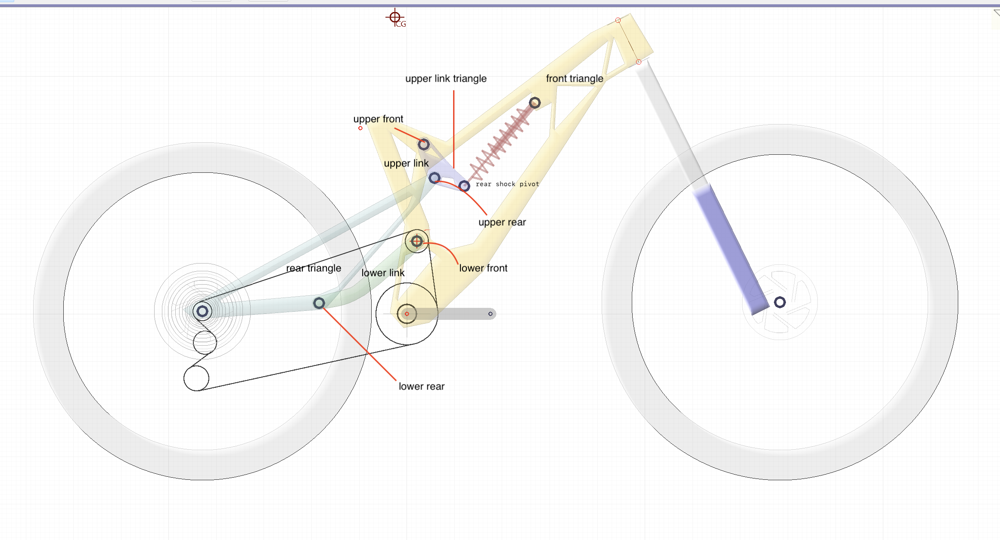
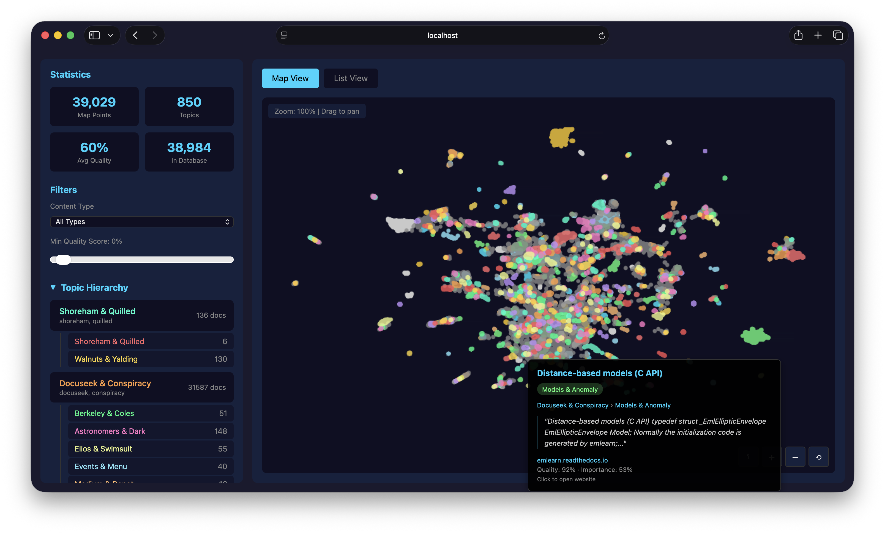

Digital Nomad 2026 Projects Progress Report

~wondering in this digital desert

For any of those project details. Contact author through email: nathan16@foxmail.com

**Simulation + Optimization solution suite for Evok Cycling (private):**

Evok Cycling is a start-up dedicated to the design, optimization and manufacturing of high-end suspension mountain bike frames.

fast optimized simulation kernel for suspension bike frames

versatile, accurate optimization modules

frontend UI

computational engineering proof-of-concept precursor.

**infolake browser:**

small-web focused pipeline

intuitive, graphic browsers

https://github.com/nathanwang16/infolake

​	**world taxonomy tree:**

​	backbone for topic classification. Combinations of several open source taxonomy tree.

​	https://github.com/nathanwang16/world_taxonomy_tree

highly personalized ways of selecting and absorbing information.

Information as means and ends.

**smash-it (private):**

badminton highlights social sharing app

&sports analytics plateform

people need a channel to express their love and progress in badminton.

**Moo Baan Dek volunteering:**

Kanchanaburi, Thailand, The Jungle School. Volunteer as a English, later as music, computer science, general science teacher. Occasionally consulting service for MBD school.

My second home. The prototype of an alternative education system.

For more story, check instagram: nathanwang.16

**Moo Baan Dek follow up reports:**

Collections of writing that attempts to present MBD and my experience to a general non-thai audience. 

Interview with UCLA Prof.Gasigitamrong to dive into thai native perspectives.

To Be Released.

Happiness. If you can't make advancements to society, just directly do something to help each of the people.

**2026 BioHackathon chromatin state prediction challenge #8:**

Didn't push for ranking. Focus on demension reduction and interpretability technique building for genomic tasks. 

https://github.com/nathanwang16/manifold-dim-reduct

Biosecurity, and mechanistic interpretability as a important field.

**ECGenie (Private):**

reverse-engineering of a scientific equipments at Harris lab.

USB protocal, algorithm approximation, cryptography heavy.

How do we advance and brace the next breakthrough in neuroscience?

Relies on web-lab acceleration, fundamental science breakthrough and ethics progress.

Who's there to do it?

**SETI (collaborative):**

SETI: [(Search for Extraterrestrial Intelligence)](https://www.seti.org/research/seti-101/seti-research/), also a UCLA seminar

a module within the grand SETI project that fetch and filters for real-time noise satellites signals

https://github.com/nathanwang16/SETI

We haven't found any yet. Thankfully.

**Oblige:**

highly automated tasks workflow using Dify and scripts to run on my server 24/7

Many great, useful tasks. Before Claw, more powerful than Claw.

Management and recreating of multiple digital online identity

Personal CRM hub & automated message assistant.

News Recommendation Engine

macOS DevOps Monitor

...

Many became the inspiration for other projects.

People desire real connections with others. Treat the world with kindness, not technology.

**Whisper, formally Walkie-talkie:**

prototype audio based social networking app

halted

a midnight summer dream.

**SeekHub (collaborative) (private):**

English-Chinese format & content transcriptor/translator

heavy pipeline engineering

discontinued

**Fractals:**

re-work of the paper: Transformers represent belief state geometry in their residual stream

https://github.com/nathanwang16/Fractal

Elegance of statistics and interpretability. What's data, really.

**AiEscape (collaborative):**

LA Hackathon 2025, Roblox Challenge #3

Education game for cybersecurity

Lots of amazing and creative ideas that combines forms with contents

**web-atlas:**

chrome/safari plugin that simply records the url one visit and when. Data stored locally. Suitable for self-behavior analysis later on.

https://github.com/nathanwang16/web_atlas/settings

**menu-vis (private) (collaborative):**

menu translation and intuitive visualization app

**algo-box (collaborative) (private):**

labeling and rendering stock data

discontinued

