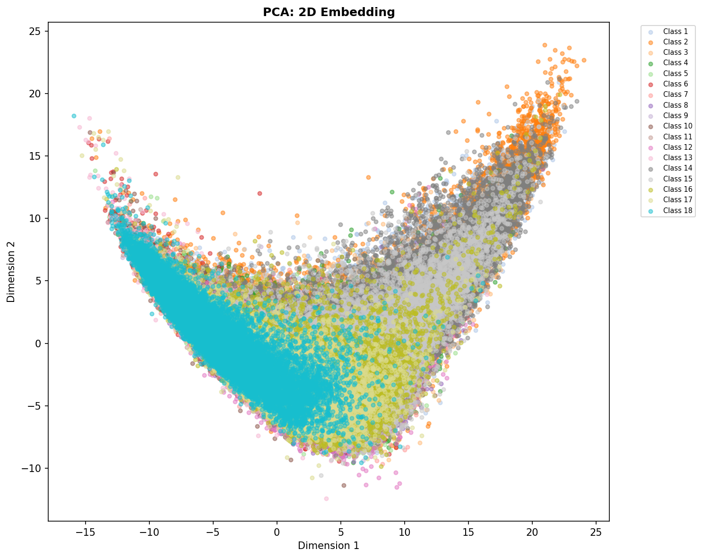
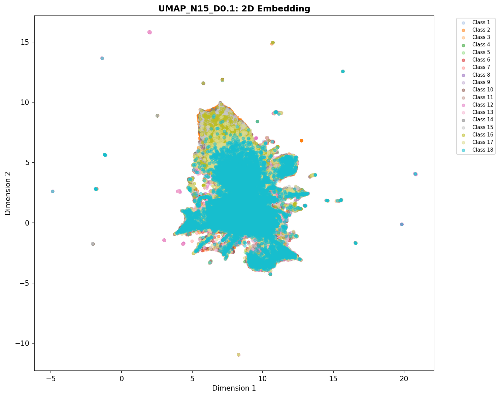
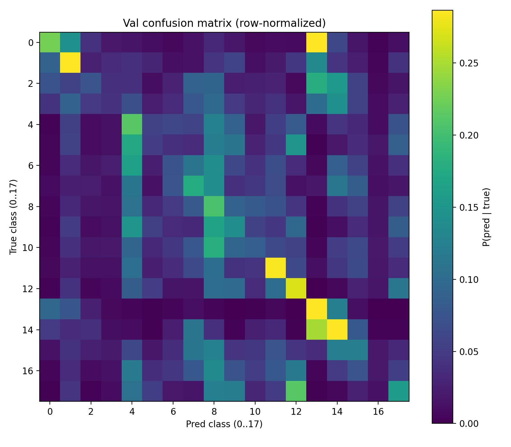
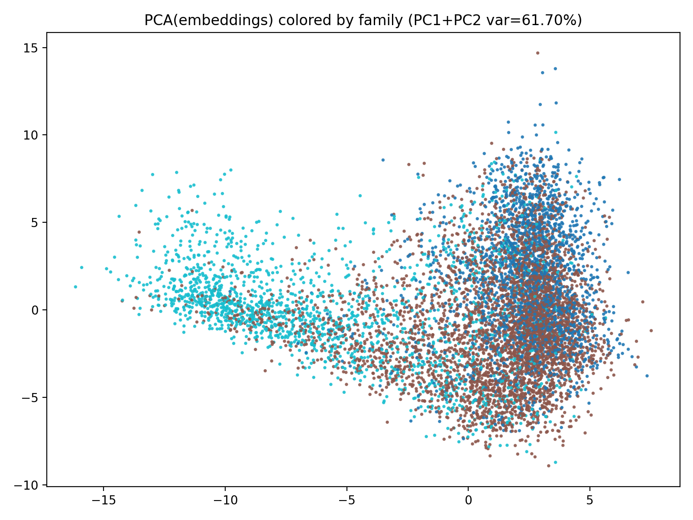

# 2026 BioHack Writeup: Mechanistic Interpretability On Bio application models

**Proposed Pipeline**

Phase 1: Genomic Data Engineering & Augmentation
Phase 2: Exploratory Manifold Analysis, dimensional reduction
Phase 3: Model: CNN
Phase 4: Causal Patching
Phase 5: Sparse Autoencoders for Feature Decomposition
Phase 6: Steering for Performance (Inference-Time Intervention)
Phase 7: Diagnostics & Saliency
Phase 8: Hacking (Enriching Metadata)

**Focus:**

Have fun and be comfortable with bold experimentations: Data insights + Mechanistic Interpretability -> Comp Bio

Intuitions on dataset: seeing the landscape of the data through manifold learning and dimension reductions

Mechanistic Interpretability: Understand causation. How, What and Why the model works

Hacking: Augementation of the dataset and bringing more Genetics context to the dataset

**Methodology:** 

Me as the head engineer/scientist know every detail in first principle. Drafting and refining plan. Researching. Reading, debugging code

Claude sonnet: actually write most of the code

**Highlights:**

### Phase 2: Exploratory Manifold Analysis
- Goal: understand dataset geometry before modeling; grouping labels on a manifold
- Representation: 6-mer frequency vectors (4096-d) as "local vocabulary"
- Methods: UMAP + PHATE (2D projections), plus PCA as baseline
- no 18 clean clusters; continuous landscape with gradients
- Key axis: GC-content gradient (promoter-like vs heterochromatin-like), yet still minority contribution

### Phase 3: CNN
- Goal: transparency-first model; easy to interpret motifs and decisions
- Core: 1D-CNN motif scanners (first conv: 128 filters, kernel ~19bp)
- Pooling: global max pooling for position invariance (paired with jittering/RC augmentation)
- SAE attachment: explicit bottleneck layer chosen as the interpretability socket

### Phase 4 & 5: Interpretability -> Sparse Autoencoder (SAE) Feature Decomposition
- Goal: convert internal activations into clean, human-readable features
- SAE: train on bottleneck activations; expand into sparse, overcomplete dictionary (e.g., 4096 features)
- Outputs: feature→label association profiles; top-activating sequences/windows per feature
- SAE didn't form linear representation of the learnable features. May be the model itself learns and perform very poorly (15% acc).

### Phase 6: Alignment -> Steering for Performance
- Goal: improve predictions without retraining by intervening on internal representations
- Trigger: low-confidence / near-tie predictions (often between biologically adjacent labels)
- Representation: compute per-label mean activation vectors at a chosen layer (e.g., bottleneck or pooled)
- Steering vector: \(v_{A \to B} = \mu_B - \mu_A\)
- Inference rule: add small \(\alpha \cdot v\) at the layer, re-run forward pass, compare confidence shift
- didn't give significant difference. Model itself learned poorly. 

### Phase 7: Diagnostics & Saliency
- Goal: verify the model uses biologically meaningful sequence evidence (not artifacts)
- Tools: saliency/attribution maps (DeepLIFT-style), confusion matrix inspection
- Confusion analysis: most confusions are between manifold neighbors (consistent with Phase 2)
- What to show in writeup: 2–3 example saliency maps + confusion matrix / top confusion pairs

  "confused_pairs": {

​    "n_pairs": 10,

​    "pairs": [

​      {

​        "label_i": 12,

​        "label_j": 17,

​        "confusion_score": 0.7327044025157232

​      },

​      {

​        "label_i": 9,

​        "label_j": 17,

​        "confusion_score": 0.6286163522012579

​      },

​      {

​        "label_i": 5,

​        "label_j": 17,

​        "confusion_score": 0.6179245283018868

​      },

​      {

​        "label_i": 4,

​        "label_j": 17,

​        "confusion_score": 0.5312991506763133

​      },

​      {

​        "label_i": 10,

​        "label_j": 17,

​        "confusion_score": 0.497011638880151

​      },

PCA dimentional reduction after hiearchical data being added. Families are easier to distinguish. 

### Phase 8: Hacking (Enriching Metadata) -> families + subclasses

- Goal: recover biological meaning of abstract labels (1–18) to enable domain info
- Step 1: per-label feature profiling
  - GC content
  - CpG observed/expected ratio + CpG frequency
  - repeat density / low-complexity indicators
  - entropy / homopolymer runs (sanity checks)
- Step 2: report + sanity checks
  - highest CpG ratio label should map to promoter-like state (TssA/TssBiv)
  - lowest GC / high repeat-density label should map to Het / ZnfRpts-like state
- Results (examples used for anchoring)
  - Label 14 → TssA (Active Promoter): high GC (~0.66), high CpG ratio (~0.74)
  - Label 2 → Het (Heterochromatin): high repeat density / low complexity
  - Label 18 → ReprPCWk (Weak Polycomb): repressive signature (weaker Polycomb-like)
- Impact on competition workflow
  - enable Phase 6 steering: steer along biologically meaningful directions, not arbitrary label IDs
  - No significant improvement on model's performance

Result

  "1": {"family": "promoter_polycomb", "subcluster": 1, "name_hint": "TssBiv_or_ReprPC_like"},

  "2": {"family": "promoter_polycomb", "subcluster": 2, "name_hint": "TssFlnk_like"},

  "3": {"family": "enhancer_like", "subcluster": 1, "name_hint": "enhancer_sub1"},

  "4": {"family": "enhancer_like", "subcluster": 1, "name_hint": "enhancer_sub1"},

  "5": {"family": "background_repressed", "subcluster": 2, "name_hint": "background_sub2"},

  "6": {"family": "background_repressed", "subcluster": 2, "name_hint": "background_sub2"},

  "7": {"family": "enhancer_like", "subcluster": 3, "name_hint": "enhancer_sub3"},

  "8": {"family": "enhancer_like", "subcluster": 3, "name_hint": "enhancer_sub3"},

  "9": {"family": "enhancer_like", "subcluster": 2, "name_hint": "enhancer_sub2"},

  "10": {"family": "background_repressed", "subcluster": 2, "name_hint": "background_sub2"},

  "11": {"family": "enhancer_like", "subcluster": 2, "name_hint": "enhancer_sub2"},

  "12": {"family": "enhancer_like", "subcluster": 3, "name_hint": "enhancer_sub3"},

  "13": {"family": "background_repressed", "subcluster": 1, "name_hint": "background_sub1"},

  "14": {"family": "promoter_polycomb", "subcluster": 1, "name_hint": "TssA_like"},

  "15": {"family": "promoter_polycomb", "subcluster": 1, "name_hint": "promoter_polycomb_sub1"},

  "16": {"family": "enhancer_like", "subcluster": 3, "name_hint": "enhancer_sub3"},

  "17": {"family": "enhancer_like", "subcluster": 2, "name_hint": "enhancer_sub2"},

  "18": {"family": "background_repressed", "subcluster": 1, "name_hint": "background_sub1"}

Conclusion:

Model's poor performance distracts meaning for much mechanistic interpretability research. Yet steering, patching and dimensional reduction gives quantitative insights on expected range of performance for any models on the task

Interpretability may potentially serve as valuable insight leverage for standard dry lab procedures

