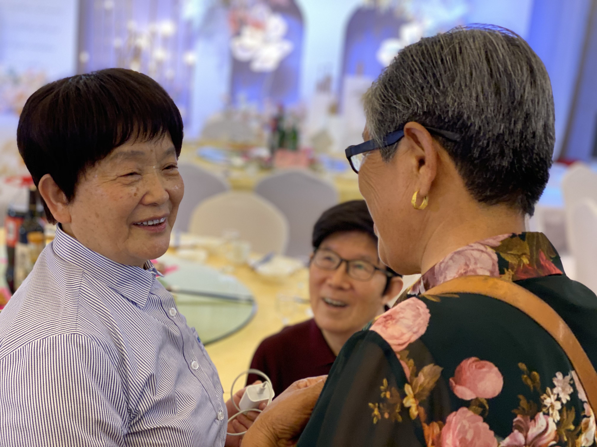
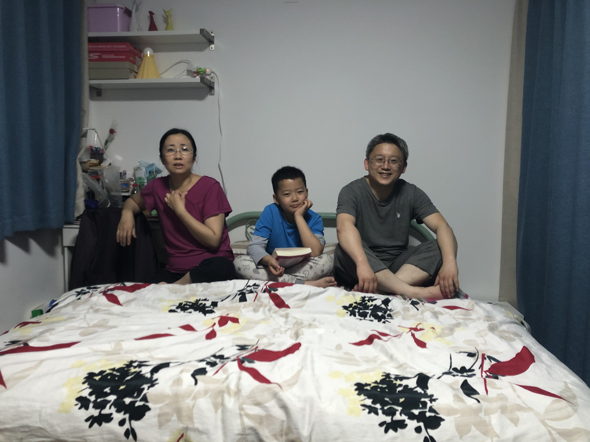
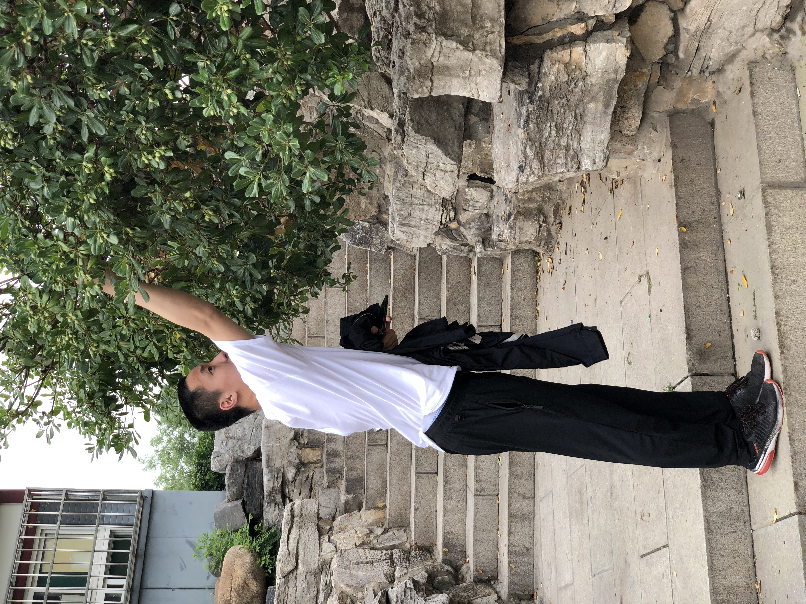
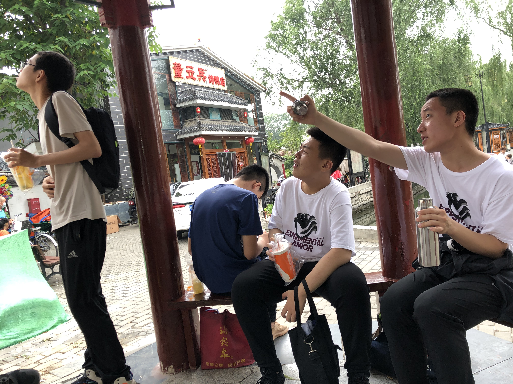

# Family

---
My lovely family not only include a few close relative but involves families that my parents met and made friends with during their ophthalmologist work time. Other families came from teammate and couch from my badminton team, both in Jinan and San Diego. And still others came from the same volunteering of my Tibet team.

|   |  |      |
| ---------------------------------------- | ---------------------------------------- | ---- |
|                                          |                                          |      |
|                                          |                                          |      |
|  |  |      |

My second home, always stayed there during weekend. 

I don't have a picture for this home, why take them if it made you that comfy?

We are also together for my first trip to Tibet. I am newbie, but they had been there couple times. Who says a trip will ruin relationships? It only made our bond stronger.

Mark, my long-term English Teacher, Former Translater. We are always roaming the English world together.

My badminton family, both in Jinan and San Diego.

