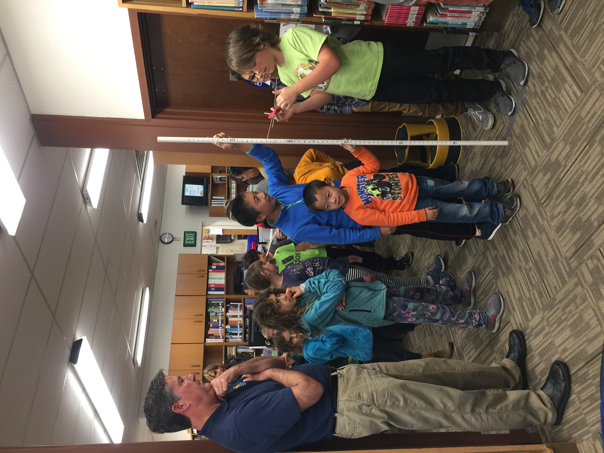
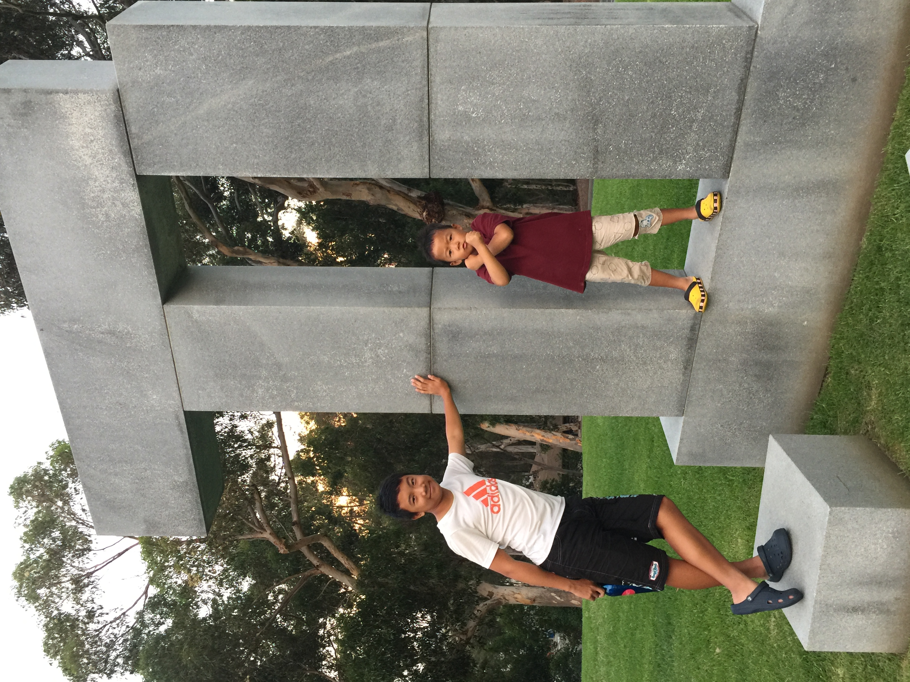
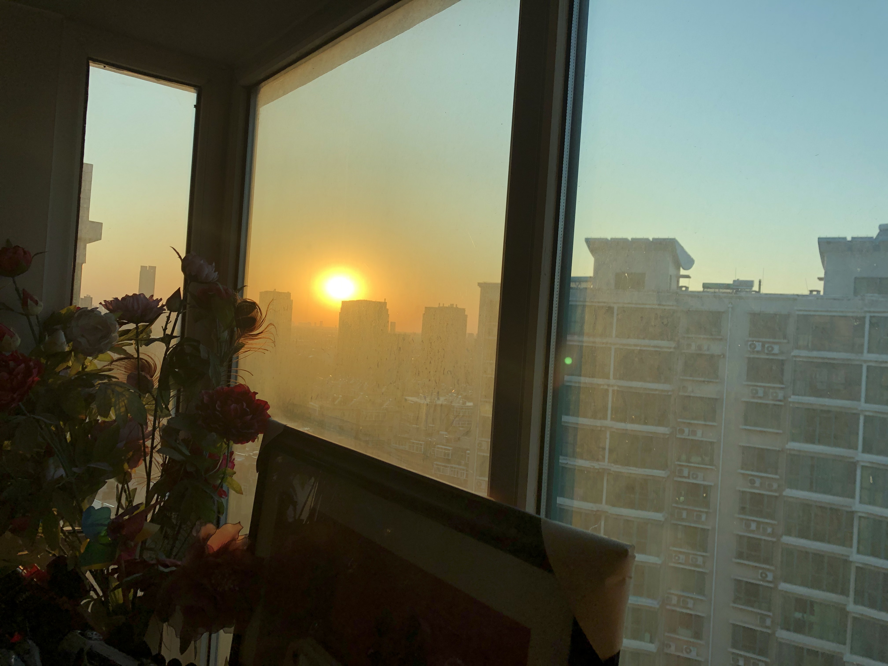
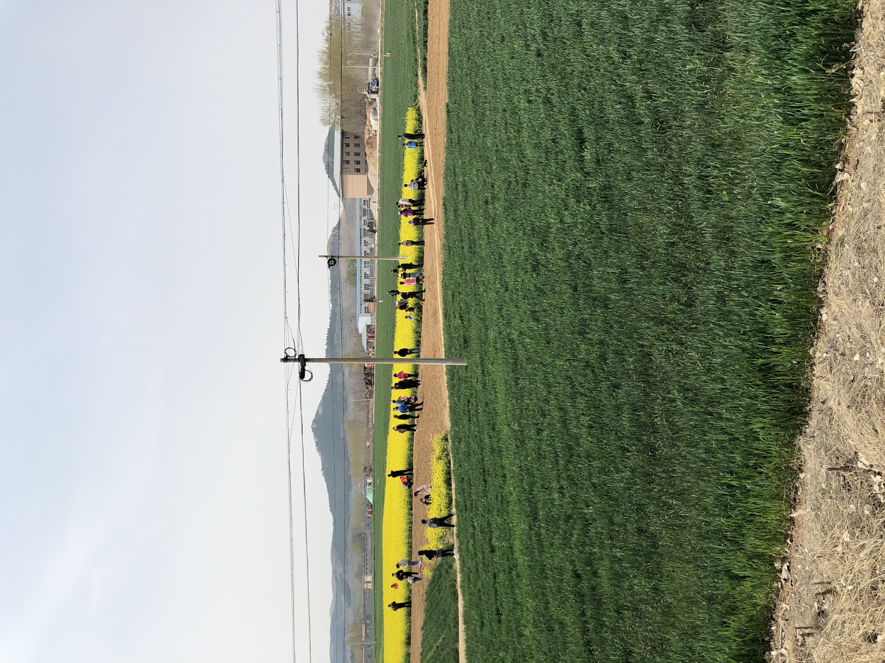
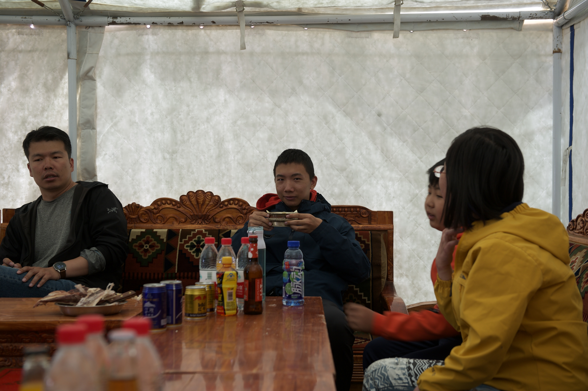
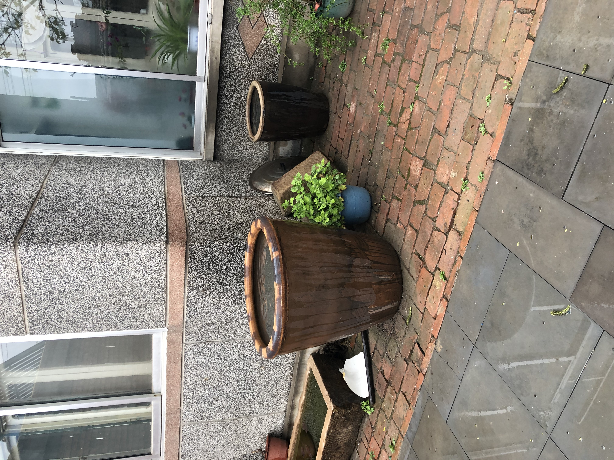

---
The places I have lived in, those special location to bunk
---

#  Geography

San Diego, where my happiest time lies

Tibet, sacred, harsh, volunteer

& Jinan, the Spring City I grew up, if you only take away one thing this will be it. Why is it so unpopular?

This is my three-body problem.

San Diego: 2 years.

<table style="width: 100%;">   <tr>     <td style="width: 25%; height: 100px;"></td>     <td style="width: 25%; height: 100px;">
</td>     <td style="width: 25%; height: 100px;"></td>     <td style="width: 25%; height: 100px;"></td>   </tr>   </table> 

<table style="width: 100%;">   <tr>     <td style="width: 25%; height: 100px;"></td>     <td style="width: 25%; height: 100px;"></td>     <td style="width: 25%; height: 100px;"></td>     <td style="width: 25%; height: 100px;"></td>   </tr>   <!-- More rows with four cells each --> </table> 

Tibet: actually went there two times.

<table style="width: 100%;">   <tr>     <td style="width: 25%; height: 100px;"></td>     <td style="width: 25%; height: 100px;">Cell 2</td>     <td style="width: 25%; height: 100px;">Cell 3</td>     <td style="width: 25%; height: 100px;">Cell 4</td>   </tr>   <!-- More rows with four cells each --> </table> 

|   |  |  |
| ------------------------------------------- | ------------------------------------------- | ------------------------------------------- |
|  |   |  |
|                                             |                                             |                                             |
|                                             |                                             |                                             |

Jinan

<table style="width: 100%;">   <tr>     <td style="width: 25%; height: 100px;"></td>     <td style="width: 25%; height: 100px;">Cell 2</td>     <td style="width: 25%; height: 100px;">Cell 3</td>     <td style="width: 25%; height: 100px;">Cell 4</td>   </tr>   <!-- More rows with four cells each --> </table> 

<table style="width: 100%;">   <tr>     <td style="width: 25%; height: 100px;"></td>     <td style="width: 25%; height: 100px;">Cell 2</td>     <td style="width: 25%; height: 100px;">Cell 3</td>     <td style="width: 25%; height: 100px;">Cell 4</td>   </tr>   <!-- More rows with four cells each --> </table> 
