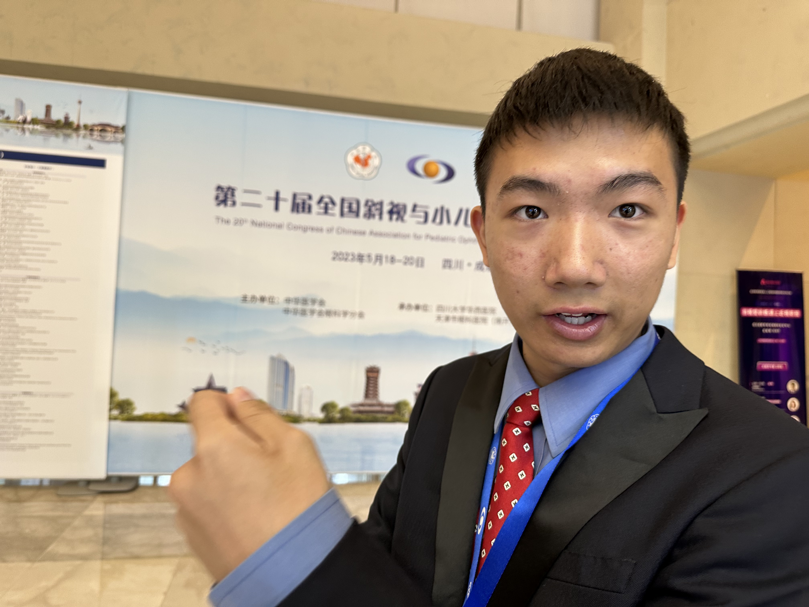

# Moments

The best moment, ever. I was helping these middle school student to choose a glasses style they want. I complemented those girls and boys, saying they look pretty and handsome, to encourage them to wear glasses. We talked about school, study, learned their language, a little. I was amazed that no matter how different our culture, there is no way to stop our curious heart to know each other. When I am about to leave, I asked if I could take a picture, I only asked a few boys, to my surprised, the whole class ran behind me. These kids have the most innocent, natural smile and laughters. Well, I kind of know what I have to fight for now...

Xigaze, Tibet. The second last day of my **Aid Tibet Brightness Action Program**. 

**The** **20th Congress of Chinese Association for Pediatric Ophthalmology and Strabismus (CAPOS)**

little afraid, also surprised that my paper got accepted by this national event. 

